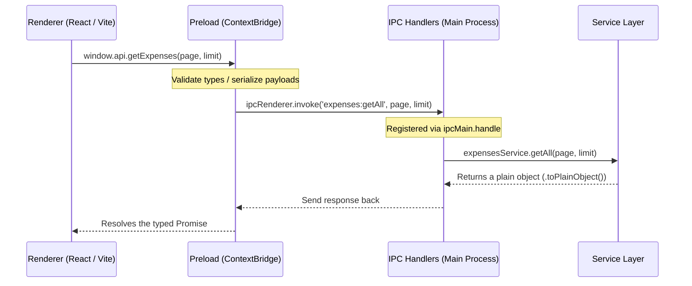

# Architecture and IPC Communication (Frontend-Backend)

This skill explains how to structure two-way communication between the React/Vite frontend (renderer process) and the Electron backend (main process) using global types, preload scripts, and IPC handlers.

---

## 1. Frontend-Backend Communication Flow

Communication follows a strict layered, one-way flow to ensure security and type safety:



---

## 2. Preload Layer (`electron/preload.ts`)

The preload script [preload.ts] acts as a secure bridge between the UI renderer process (running in a sandboxed environment) and the main Electron process.

It uses `contextBridge.exposeInMainWorld` to expose secure functions under `window.api`:

```typescript
import { contextBridge, ipcRenderer } from 'electron';

contextBridge.exposeInMainWorld('api', {
  // Example: Retrieve paginated expenses
  getExpenses: (page: number, limit: number): Promise<unknown> =>
    ipcRenderer.invoke('expenses:getAll', page, limit),

  // Example: Create a new expense
  createExpense: (data: unknown): Promise<unknown> =>
    ipcRenderer.invoke('expenses:create', data),
});
```

* **Rule**: Never expose the raw `ipcRenderer` object directly to the frontend. Only expose wrapper functions that invoke pre-defined IPC channels.

---

## 3. Global Frontend Types (`renderer/src/types/global.d.ts`)

For TypeScript to recognize methods on `window.api` in the frontend, declare them in the global types declaration file [global.d.ts](file:///c:/Users/Luis/Documents/PROJECTS/BACE-ELECTRON/renderer/src/types/global.d.ts):

```typescript
import type { Expense, CreateExpenseForm } from "../features/cashSession/types";

declare global {
  interface Window {
    api: {
      getExpenses: (page: number, limit: number) => Promise<{
        data: Expense[];
        pagination: {
          page: number;
          limit: number;
          total: number;
          totalPages: number;
          hasNext: boolean;
          hasPrev: boolean;
        };
      }>;
      createExpense: (data: CreateExpenseForm) => Promise<Expense>;
    };
  }
}

export { };
```

---

## 4. Main Process IPC Handlers

IPC channels are handled in the main process using `ipcMain.handle`.

### A. IPC Module File (e.g., `electron/ipc/expensesIpc.ts`)
Each module defines its listeners in its own IPC file inside `electron/ipc/`:

```typescript
import { ipcMain } from 'electron';
import expensesService from '../services/expensesService';
import type { CreateExpenseData } from '../types/expense';

export function registerExpensesIpc(): void {
  ipcMain.handle('expenses:getAll', async (_event, page: number, limit: number) => 
    await expensesService.getAll(page, limit)
  );

  ipcMain.handle('expenses:create', async (_event, data: CreateExpenseData) => 
    await expensesService.create(data)
  );
}
```

### B. Central Registration (`electron/ipc/index.ts`)
All module handlers are imported and invoked within the main registration function in [ipc/index.ts]:

```typescript
import { registerExpensesIpc } from './expensesIpc';

export function registerIpcHandlers(): void {
  // ...other handlers
  registerExpensesIpc();
}
```

This main entry is executed inside `app.whenReady()` in [electron/index.ts].

---

## 5. Structured Cloning for IPC
Because Electron IPC data crosses process boundaries:
1. **Class instances cannot be transmitted directly** (e.g. methods and getters are stripped).
2. The Service layer must convert complex domain models to plain JavaScript objects using `.toPlainObject()` before returning them to the IPC layer.
3. Unsupported JavaScript types (such as `BigInt`, symbols, or functions) are not allowed in IPC payloads.
