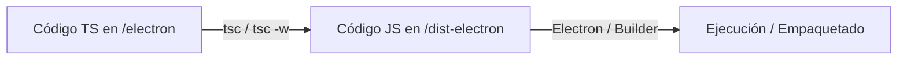

# Análisis de Migración: JavaScript a TypeScript en Electron

Este documento evalúa la viabilidad, complejidad y estrategia recomendada para migrar el proceso principal (backend) de Electron en la aplicación SETH de **JavaScript (JS)** a **TypeScript (TS)**.

---

## 1. Viabilidad General (Feasibility)

La migración es **altamente viable** y aportará un gran valor al proyecto en términos de estabilidad, autocompletado y prevención de errores en tiempo de ejecución. 

### Puntos clave de viabilidad:
* **Tamaño del Backend:** El backend cuenta con aproximadamente **58 archivos** distribuidos de forma modular (~450 KB totales). Es un tamaño ideal para una migración progresiva.
* **Sin Dependencias Nativas Complejas:** No hay dependencias nativas en C/C++ que suelan causar problemas de compilación (como `sqlite3` nativo, `node-gyp`, etc.). Las librerías core son **pure JS** o tienen soporte excelente:
  * `pg` (PostgreSQL): posee tipos completos vía `@types/pg`.
  * `bcryptjs`: posee tipos completos vía `@types/bcryptjs`.
  * `fs-extra` y `uuid`: poseen tipos excelentes.
* **Contrato IPC Listo (Ventaja Crítica):** El frontend ya cuenta con un archivo de definición de tipos global muy detallado en [global.d.ts](file:///c:/Users/Luis/Documents/PROJECTS/SETH-ELECTRON/renderer/src/types/global.d.ts). Este archivo define con precisión el objeto `window.api`, lo cual proporciona un **contrato listo para tipar los servicios y manejadores IPC** en el backend sin tener que deducir las firmas de las funciones desde cero.

---

## 2. Nivel de Dificultad (Complexity)

El nivel de dificultad estimado es **Medio-Bajo**. El principal reto no está en el código en sí, sino en el **proceso de compilación**.

Actualmente, el backend de Electron se ejecuta directamente desde el código fuente JS en `./electron/index.js` sin ningún paso intermedio de build. Al usar TypeScript, debemos introducir un compilador (`tsc` o un empaquetador como `tsup`/`esbuild`) para generar el código JavaScript compilado que Electron realmente ejecutará.

### Tabla de Complejidad por Componente:

| Componente | Archivos | Complejidad | Notas |
| :--- | :---: | :---: | :--- |
| **Configuración del Build** | N/A | **Media** | Ajustar `package.json` y configurar `tsconfig.json` para compilar a `./dist-electron`. |
| **Modelos del Dominio (`domain/`)** | 18 | **Baja** | Clases ES6 simples. Se convierten muy rápido definiendo tipos/interfaces para los constructores. |
| **Acceso a Datos (`repositories/`)** | 16 | **Media-Baja** | Consultas SQL directas a través de `db.js`. Requiere tipar las filas devueltas por PostgreSQL. |
| **Lógica de Negocio (`services/`)** | 17 | **Baja** | Clases con lógica de negocio pura. Se benefician directamente de los tipos definidos en el frontend. |
| **Puntos de Entrada (`index.js` y `preload.js`)** | 2 | **Media** | Asegurar que `__dirname` apunte a las rutas correctas para el `preload` y la carga del index HTML. |

---

## 3. Estrategia de Compilación Recomendada

Para evitar reestructurar drásticamente el proyecto (lo cual ocurriría si cambiamos a herramientas pesadas como `electron-vite`), la opción más sencilla y menos intrusiva es usar el compilador oficial de TypeScript (`tsc`) configurado en modo preservador de estructura.

### Flujo de Compilación Propuesto:


* **Desarrollo:** `tsc -w` (modo observación) compilará los archivos TS a JS en la carpeta `dist-electron` de forma instantánea al guardar. Electron ejecutará los archivos resultantes desde `dist-electron/index.js`.
* **Producción:** Se compilará el backend mediante `tsc`, el frontend mediante Vite, y `electron-builder` empaquetará la app usando los archivos de la carpeta `dist-electron/`.

---

## 4. Plan de Migración Paso a Paso (Gradual)

Gracias a que TypeScript permite la convivencia de archivos JS y TS (`allowJs: true`), **no es necesario migrar todo a la vez**. Puedes hacerlo de forma incremental.

### Fase 1: Infraestructura y Build (El Backend sigue siendo JS)
1. **Instalar dependencias de desarrollo** en la raíz del proyecto:
   ```bash
   pnpm add -D typescript @types/node @types/pg @types/bcryptjs @types/fs-extra @types/mime-types @types/uuid -w
   ```
2. **Crear `tsconfig.json`** en la raíz (ver configuración propuesta más abajo).
3. **Modificar los scripts del `package.json` de la raíz** para compilar el código.
4. **Modificar el campo `"main"` del `package.json` de la raíz** para apuntar a `dist-electron/index.js`.
5. Ejecutar la compilación inicial. El compilador copiará/compilará todos los archivos `.js` de `electron/` a `dist-electron/`. **Verificar que la aplicación se ejecute e instale correctamente en este estado antes de cambiar extensiones a `.ts`.**

### Fase 2: Migración del Dominio y Base de Datos (Con revisión activa de tipos)
1. **Copiar y renombrar con extensión de respaldo:** En lugar de renombrar directamente, haz una copia de `electron/db.js` llamada `electron/db.ts`. Para evitar que TypeScript proteste por declaraciones duplicadas de variables o clases en la misma carpeta:
   * **Renombra el archivo original `.js` a `.js.bak` o `.js.old`** (ej. `db.js` -> `db.js.bak`). De esta forma, el compilador `tsc` ignorará el archivo antiguo, pero lo tendrás disponible en el mismo directorio para compararlo lado a lado en tu editor.
   * **Revisión activa de tipos:** Abre `db.ts` y tipa detalladamente el pool de conexiones y las transacciones de PostgreSQL.
2. Realiza el mismo proceso con los archivos de `electron/domain/` (copiar, renombrar el JS a `.js.bak`, y modificar el `.ts` aplicando tipados estrictos a los constructores y métodos de utilidad).

### Fase 3: Migración de Repositorios y Servicios
1. **Mapeo y tipado de consultas:** Copia y migra los archivos de `electron/repositories/` a `.ts` (pasando el original a `.js.bak`). Aquí no solo se cambia la extensión, sino que se deben revisar minuciosamente los tipos de las filas devueltas por PostgreSQL y los parámetros de las funciones.
2. **Cumplimiento del Contrato IPC:** Copia y migra los archivos de `electron/services/` a `.ts`. Asegura que cada servicio implemente los tipos definidos en la interfaz de la UI ([global.d.ts](file:///c:/Users/Luis/Documents/PROJECTS/SETH-ELECTRON/renderer/src/types/global.d.ts)) para que los retornos de promesas y los parámetros de entrada coincidan de forma exacta.
3. **Manejo de archivos concurrentes:** Mantener `allowJs: true` en la configuración del compilador garantiza que la aplicación continúe funcionando a la perfección incluso si solo has migrado un par de servicios y el resto siguen siendo los archivos `.js` originales (sin extensión `.bak`).

### Fase 4: Migración de Preload y Punto de Entrada (`index.ts`)
1. Migrar `electron/preload.js` a `electron/preload.ts` (original a `.js.bak`) y validar el tipado del puente de `contextBridge`.
2. Migrar `electron/index.js` a `electron/index.ts` (original a `.js.bak`).
3. Ajustar `__dirname` para que apunte correctamente a los recursos y archivos HTML relativos en `dist-electron`.
4. Una vez completado, puedes eliminar todos los archivos temporales `.js.bak` o guardarlos en tu historial de Git. Opcionalmente, puedes cambiar `allowJs: true` a `false` en `tsconfig.json` para bloquear cualquier código que no esté completamente tipado.


---

## 5. Propuestas de Configuración de Código

### `tsconfig.json` Propuesto (Raíz del proyecto)
Crea este archivo en la raíz para controlar la compilación del backend:

```json
{
  "compilerOptions": {
    "target": "ES2022",
    "module": "CommonJS",                  /* Electron prefiere CommonJS por defecto */
    "moduleResolution": "node",
    "outDir": "./dist-electron",           /* Carpeta de salida del JS compilado */
    "rootDir": "./electron",               /* Carpeta origen de los archivos TS */
    "allowJs": true,                       /* Permite archivos JS para la migración incremental */
    "checkJs": false,                      /* No valida tipos en JS durante la transición */
    "strict": true,                        /* Habilita validaciones estrictas en archivos TS */
    "esModuleInterop": true,                /* Permite usar "import x from 'cjs'" en TS */
    "sourceMap": true,                      /* Genera mapas para debugging en el código TS fuente */
    "skipLibCheck": true,
    "forceConsistentCasingInFileNames": true
  },
  "include": ["electron/**/*"],
  "exclude": ["node_modules", "renderer/**/*"]
}
```

### Modificación en `package.json` de la raíz
Debes actualizar los scripts para compilar el backend antes de iniciar la app o empaquetarla:

```diff
- "main": "electron/index.js",
+ "main": "dist-electron/index.js",
  "scripts": {
    "postinstall": "",
-   "dev:electron": "electron ./electron --no-sandbox",
+   "build:electron": "tsc",
+   "watch:electron": "tsc -w",
+   "dev:electron": "electron ./dist-electron --no-sandbox",
-   "dev": "concurrently -k --success first \"pnpm run dev:electron\" \"cd renderer && pnpm run dev\"",
+   "dev": "concurrently -k --success first \"tsc && tsc -w\" \"pnpm run dev:electron\" \"cd renderer && pnpm run dev\"",
-   "build": "cd renderer && pnpm run build",
+   "build": "tsc && cd renderer && pnpm run build",
-   "dist": "pnpm run build && electron-builder",
+   "dist": "pnpm run build && electron-builder",
    "dist:win": "pnpm run build && electron-builder --win",
    "dist:git": "pnpm run build && electron-builder --win -p always"
  },
```

> [!NOTE]
> En la sección de configuración de `build` de `electron-builder` en tu `package.json`, asegúrate de cambiar la regla de copia de archivos para incluir `"dist-electron/**/*"` en lugar de `"electron/**/*"`.

---

## 6. Consideraciones Especiales en Electron

Al migrar a TypeScript en Electron, ten en cuenta los siguientes puntos críticos:

### A. El uso de `__dirname` y rutas de archivos
Cuando ejecutas en producción, `__dirname` apuntará a `dist-electron/` en vez de `electron/`. 
Por ejemplo, la carga del preload script se realiza mediante:
```javascript
preload: path.join(__dirname, 'preload.js')
```
Esto seguirá funcionando perfectamente si el compilador escribe `preload.js` dentro del mismo nivel jerárquico en `dist-electron/preload.js`.
Sin embargo, para buscar el index del frontend:
```javascript
win.loadFile(path.join(__dirname, '../renderer/dist/index.html'))
```
Como `dist-electron` está en el mismo nivel que `electron`, la ruta relativa subiendo un directorio (`../renderer/dist`) seguirá siendo exactamente igual. Esto hace que la migración sea extremadamente segura.

### B. El preload script y `require`
El script de preload (`preload.ts`) se ejecuta en un contexto especial. Al ser compilado a CommonJS por TypeScript, conservará el uso nativo de `require('electron')` sin problemas. Sin embargo, hay un detalle importante: el contexto del preload **no tiene acceso al módulo `electron/main`**, por lo que solo debes importar desde `'electron'` los módulos del renderer-process (como `contextBridge` e `ipcRenderer`).

> [!IMPORTANT]
> Cuando la aplicación está empaquetada (`app.isPackaged === true`), `__dirname` dentro del ASAR apunta a una ruta virtual. Para resolver rutas de recursos que residen **fuera** del ASAR (como el archivo `.db` de la base de datos), usa siempre `app.getPath('userData')` o `app.getAppPath()` en lugar de `path.join(__dirname, ...)`.

### C. Types Compartidos
En lugar de mantener tipos por duplicado, puedes mover las interfaces del dominio que se usan tanto en el backend como en el frontend a una carpeta común (ej. una carpeta `/shared` o referenciar directamente interfaces del renderer desde el main mediante aliases en la configuración).

### D. Módulos Nativos, auto-update (electron-updater) y Releases de GitHub
El uso de un módulo nativo como `better-sqlite3` (que contiene binarios de C++ compilados) **no genera problemas** con `electron-updater` ni con las descargas automáticas desde GitHub Releases.
* **Por qué funciona:** Cuando `electron-builder` genera el instalador (por ejemplo, el `.exe` de NSIS para Windows), compila y empaqueta el binario nativo correspondiente de `better-sqlite3` para la plataforma y arquitectura destino. El cliente final descarga el instalador completo e instala el ejecutable final ya precompilado. El cliente **nunca compila código en su máquina**.
* **Precaución crítica (Persistencia de Datos):** Al actualizar la app mediante auto-update, el directorio de instalación de la app se sobrescribe. Por lo tanto, **NUNCA debes guardar el archivo SQLite dentro del directorio de la aplicación** (como `dist-electron/` o `resources/`). La base de datos debe ser guardada siempre en el directorio de datos del usuario, el cual no es tocado por las actualizaciones:
  ```javascript
  const { app } = require('electron');
  const path = require('path');
  
  // Guardar la base de datos de forma segura fuera del directorio de instalación
  const dbPath = path.join(app.getPath('userData'), 'seth_database.db');
  ```

---

## 7. Soporte para Multi-Base de Datos (PostgreSQL / SQLite) y uso de ORM

Si planeas dar soporte a **PostgreSQL o SQLite según el cliente**, mantener consultas SQL crudas (raw SQL) en JS/TS es un desafío de mantenimiento muy complejo debido a las diferencias de dialecto:

* **Sintaxis de Parámetros:** PostgreSQL utiliza `$1, $2`, mientras que SQLite utiliza `?`.
* **Tipos de Datos:** PostgreSQL maneja tipos nativos de decimales, booleanos y fechas. SQLite almacena todo como `TEXT`, `INTEGER`, o `REAL`, lo que requiere un formateo manual al guardar y leer.
* **Sentencias Especiales:** Operaciones como `RETURNING *` o la sintaxis de autoincrementales cambian significativamente.

### Comparativa de Soluciones para SETH:

#### Opción A: Migrar a TypeScript + Knex.js (Query Builder) — ⭐ [RECOMENDADO]
Knex.js es un constructor de consultas maduro, robusto y ampliamente probado en Electron.
* **Por qué es la mejor opción para SETH:**
  * **Soporte Dialecto Agnóstico Real:** Escribes tus esquemas y consultas una sola vez de forma programática (ej: `table.increments('id')`, `knex('orders').select()`) y Knex traduce automáticamente a SQL de Postgres o SQLite en tiempo de ejecución.
  * **Robustez Extrema:** Knex es código JavaScript/TypeScript puro y maduro. No utiliza magia de compilación en runtime ni decoradores reflectores complejos. Una vez que funciona en desarrollo, tienes la certeza de que **no romperá la app en producción** después del empaquetado.
  * **Fácil Integración:** Se integra perfectamente con tus repositorios actuales de manera incremental sin tener que rediseñar las clases del dominio.
* **Desventajas:** Mapeo manual de filas a tus clases del dominio (lo cual ya estás haciendo en tu código actual mediante métodos como `.toPlainObject()`, por lo que no añade trabajo extra).

> [!WARNING]
> **El reto de los Módulos Nativos:** Si decides usar SQLite (con Knex), estarás incorporando un driver nativo de C++ (`better-sqlite3`). Esto significa que, **independientemente de si usas TypeScript o te quedas en JavaScript**, tendrás que lidiar con la compilación nativa para Electron (`electron-rebuild`). Por tanto, la migración a TS no aumenta la dificultad de usar SQLite, sino que la facilita al darte herramientas para manejar el multi-motor de forma limpia.

---

## 8. Hoja de Ruta de Implementación (Estrategia de Despliegue Seguro)

Tu estrategia de **migrar primero a TypeScript (manteniendo PostgreSQL) para el Cliente 1 y luego implementar Knex.js para el Cliente 2** es excelente. Esto aísla los riesgos de compilación de los riesgos de base de datos. 

A continuación, se detalla el orden de los pasos recomendados para implementarlo sin poner en riesgo al Cliente 1:

### Fase 1: Migración a TS + PG en la rama principal (`main`)
* **Qué hacer:** Copiar y renombrar archivos a `.ts` y los antiguos como  `.js.bak` y configurar la compilación (`tsconfig.json`, `package.json`), pero **sin cambiar ni una sola consulta SQL ni la conexión a Postgres (`pg`)**.
* **Por qué es seguro:** La lógica de la base de datos sigue siendo idéntica a la que el Cliente 1 ya usa. El único cambio es que ahora el código pasa por el compilador `tsc`.
* **Resultado:** Despliegas una actualización segura para el Cliente 1. Si la app inicia y funciona, habrás validado al 100% que tu nuevo flujo de compilación y empaquetado funciona en producción sin romper nada.

### Fase 2: Bifurcación Física (Forks) en Repositorios Independientes
Dado que has decidido definitivamente usar repositorios distintos para cada cliente con el fin de garantizar la máxima seguridad y aislamiento:
* **Cuándo hacer el Fork:** Haz el fork del repositorio **únicamente después de haber completado y probado la Fase 1 (TS + PG)** en el repositorio del Cliente 1.
* **Por qué es la mejor secuencia:** 
  * Al hacer el fork después de la migración a TS, el nuevo repositorio (para el Cliente 2) heredará una base de código moderna y tipada al 100%. 
  * Migrar a Knex.js en un entorno con TypeScript es sustancialmente más rápido y seguro, ya que el compilador te indicará de inmediato si estás cometiendo errores de firma de funciones, retornos de datos o parámetros durante la refactorización de tus repositorios de SQL crudo a Knex.

### Fase 3: Integración de Knex.js y SQLite (En el nuevo repositorio/fork)
1. Instalar `knex`, `better-sqlite3` y `electron-rebuild` en el repositorio del Cliente 2.
2. Crear un archivo `knexfile.ts` para gestionar las conexiones.
3. Migrar `electron/db.ts` para que exponga la instancia de Knex en lugar del pool de `pg`.
4. Reescribir de forma progresiva los archivos en `electron/repositories/` usando el Query Builder de Knex (apuntando a SQLite local).
5. Ejecutar `electron-rebuild` para asegurar que el binario de `better-sqlite3` compile para la versión de Electron en desarrollo y producción.

---

## Conclusión

1. **GitHub Releases y auto-update:** Funcionarán perfectamente con `better-sqlite3` porque el binario se compila durante tu proceso de empaquetado y se distribuye ya listo para el usuario. Recuerda usar `app.getPath('userData')` para guardar el archivo `.db` y así evitar pérdida de información al actualizar.
2. **Recomendación de Librería:** **Knex.js** es la opción más estable, funcional y rápida de programar para tu caso de uso. Te permite soportar dinámicamente PostgreSQL y SQLite con el mismo código de consulta sin lidiar con los esquemas específicos de Drizzle ni las complicaciones de empaquetado de TypeORM.
3. **Estrategia Final Aprobada:**
   * **Paso 1:** Migrar a TS el backend actual manteniendo Postgres. Desplegar esta versión segura al **Cliente 1** (cero riesgo de regresión de base de datos).
   * **Paso 2:** Hacer fork del repositorio migrado a TS para crear el proyecto del **Cliente 2**.
   * **Paso 3:** Implementar Knex + SQLite en el nuevo repositorio. Esto garantiza un desarrollo rápido bajo TS y asegura al 100% que la base de código del Cliente 1 jamás se verá afectada por cambios en la lógica de datos.


