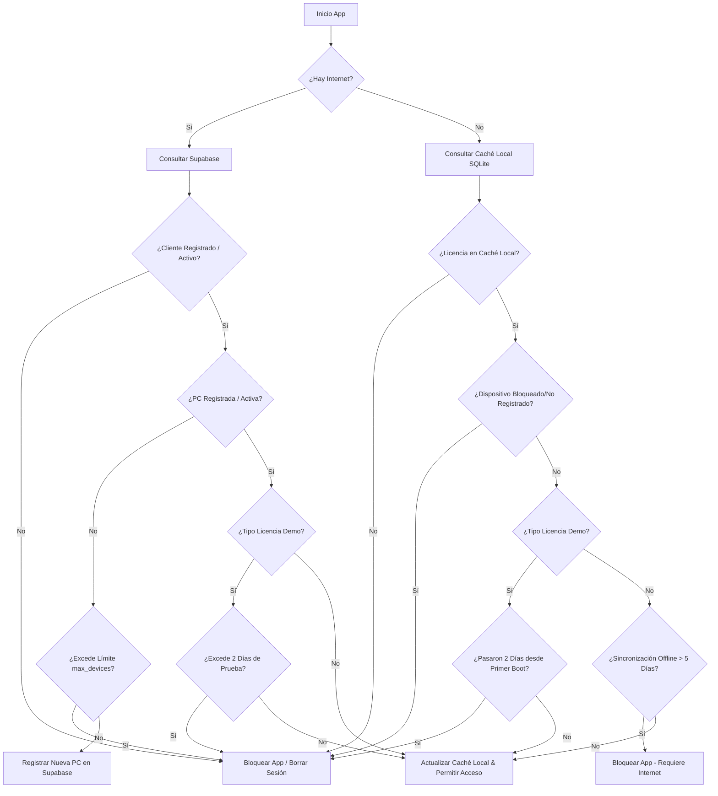
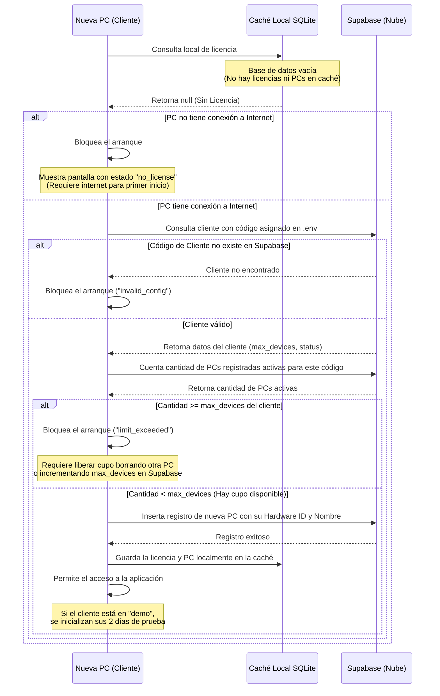

# Sistema de Control de Licencias y Verificación de PCs (SETH)

Este documento detalla la arquitectura, el diseño de la base de datos, el flujo de verificación y las pautas de integración del nuevo **Sistema de Control de Licencias** implementado en la aplicación de escritorio **SETH**.

---

## 1. Arquitectura General (3 Capas)

El sistema opera con tres capas de resiliencia y validación de seguridad física:
1. **Servidor Central (Nube - Supabase)**: Fuente de verdad única. Mantiene el registro global de clientes, licencias pagadas, periodos demo y computadoras registradas.
2. **Base de Datos Local (Caché - SQLite/PostgreSQL)**: Almacena localmente una copia cifrada del estado de la licencia y los dispositivos autorizados en la red local de la oficina para permitir operaciones seguras sin conexión a internet.
3. **Validación Física del Dispositivo (Hardware ID)**: Uso de identificadores de hardware físicos únicos mediante `node-machine-id` (con respaldo automático por software si falla la lectura nativa) para certificar que el dispositivo está autorizado.



---

## 2. Definición del Esquema de Datos

### En la Nube (Supabase)
Definido en el archivo [supabase_schema.sql](file:///home/luis/Projects/IMPRENTA-SETH/supabase/supabase_schema.sql):

- **`clientes`**:
  - `client_code` (TEXT, PK): Código único del instalador asignado al cliente.
  - `max_devices` (INTEGER): Número máximo de computadoras autorizadas concurrentemente.
  - `status` (TEXT): Estado actual (`'demo'` o `'activo'`).
  - `is_suspended` (BOOLEAN): Bandera de suspensión manual.
- **`dispositivos`**:
  - `hardware_id` (TEXT, PK): Identificador físico único obtenido del equipo.
  - `client_code` (FK a `clientes`): Relación con el cliente.
  - `device_name` (TEXT): Nombre descriptivo de la PC (ej. "Caja Principal").
  - `is_blocked` (BOOLEAN): Estado de bloqueo individual.
  - `first_boot` (TIMESTAMPTZ): Registro de la primera vez que se inició la app.
  - `last_connection` (TIMESTAMPTZ): Última sincronización online.

### En Caché Local (SQLite/PostgreSQL)
Definido en [schemaTables.ts](file:///home/luis/Projects/IMPRENTA-SETH/electron/schemaTables.ts):

- **`local_licenses`**:
  - Cacha el código de cliente, estado general (demo/activo), suspensión manual, y la fecha del último control online.
- **`local_devices`**:
  - Cacha los equipos validados localmente con sus respectivos hardware IDs, nombres y banderas de bloqueo individual.

---

## 3. Implementación del Backend

### Servicio de Licencias (`licenseService.ts`)
Ubicado en [licenseService.ts](file:///home/luis/Projects/IMPRENTA-SETH/electron/services/licenseService.ts):
- Resuelve el HWID físico mediante `node-machine-id` con un robusto sistema de respaldo basado en UUIDs locales persistentes.
- Detecta conectividad de forma segura a través de `electron.net`.
- Implementa el algoritmo de validación de 2 días de prueba para la demo, conteo dinámico de computadoras activas, y bloqueo inmediato por suspensión o exceso de cupos.
- Ejecuta `authService.logout()` de forma automática si la licencia es inválida para evitar cualquier tipo de bypass de la sesión local.

### Canal IPC y Preload (`licenseIpc.ts` & `preload.ts`)
- Registrado el manejador `'license:check'` en [licenseIpc.ts](file:///home/luis/Projects/IMPRENTA-SETH/electron/ipc/licenseIpc.ts).
- Expuesto de forma segura al frontend a través de `window.api.checkLicense()` en [preload.ts](file:///home/luis/Projects/IMPRENTA-SETH/electron/preload.ts).

---

## 4. Interfaz de Usuario y Guards (`LicenseBlockScreen`)

Ubicado en [LicenseBlockScreen.tsx](file:///home/luis/Projects/IMPRENTA-SETH/renderer/src/components/layout/LicenseBlockScreen.tsx):
- Diseñado con una interfaz de estética premium y oscura usando efectos de difuminado (`backdrop-blur`) y gradientes modernos acordes a la identidad visual de la aplicación.
- Presenta instrucciones claras según el motivo del bloqueo:
  - **Cliente Suspendido**: Contacto con soporte técnico.
  - **Equipo Bloqueado**: Equipo específico deshabilitado por el administrador.
  - **Periodo de Prueba Expirado**: Alerta para regularización y pago de licencia.
  - **Límite de Equipos Superado**: Solicitud de incremento de equipos permitidos.
  - **Conexión Requerida**: Notificación de límite de 5 días sin internet alcanzado.
- Incluye un botón para copiar el **ID de Hardware (UUID)** al portapapeles con confirmación visual de micro-animaciones, facilitando el soporte remoto.
- Incluye un disparador de "Reintentar Verificación" para consultar de inmediato el servidor sin necesidad de reiniciar la aplicación.

---

## 5. Configuración de Variables de Entorno

Tanto el archivo `.env.example` como el archivo activo `.env` han sido actualizados con los siguientes parámetros requeridos:

```env
# CONFIGURACIÓN DEL SISTEMA DE LICENCIAS (SUPABASE)
SUPABASE_URL=https://your-project-id.supabase.co
SUPABASE_KEY=your-supabase-anon-or-service-role-key
CLIENT_LICENSE_CODE=SETH-CLI-102
DEVICE_NAME="Caja Principal"
```

---

## 6. Flujo Detallado para Nuevos Dispositivos (Primer Inicio)

Cuando la aplicación se instala por primera vez en una computadora nueva, el ciclo de arranque y registro sigue este protocolo:



### Reglas Críticas del Primer Inicio:
1. **Obligatoriedad de Internet**: Un nuevo dispositivo **siempre** requiere conectividad a internet en su primer inicio. Esto es indispensable para registrar su Hardware ID en la nube de Supabase y validar que el cliente tiene cupos disponibles. Si no tiene internet en el primer arranque, la aplicación se bloquea mostrando el mensaje de registro pendiente (`no_license`).
2. **Consumo de Cupo**: Al registrarse con éxito, el dispositivo consume permanentemente 1 cupo de los permitidos por el límite `max_devices` del cliente.
3. **Persistencia Local**: Una vez registrado con éxito online, el backend escribe en el SQLite local los datos de la licencia (`local_licenses`) y el dispositivo (`local_devices`). A partir de ese momento, la PC puede operar sin conexión (hasta un máximo de 5 días offline continuos antes de exigir una re-validación online).

---

## 7. Instrucciones para el Administrador / Desarrollador (Tú)

Para registrar un nuevo cliente y vincular sus equipos correctamente, sigue este procedimiento:

1. **Registrar al Cliente en Supabase (Paso Previo Obligatorio):**
   * Antes de entregar el instalador, accede a tu consola de base de datos de Supabase.
   * Inserta un nuevo registro en la tabla `clientes`:
     ```sql
     INSERT INTO clientes (client_code, max_devices, status, is_suspended)
     VALUES ('SETH-CLI-XYZ', 3, 'activo', false);
     ```
     *(Sustituye `SETH-CLI-XYZ` por el código de cliente y `3` por la cantidad máxima de computadoras autorizadas)*.
2. **Preparar el Instalador (`.env`):**
   * En el directorio de la aplicación para este cliente, configura su archivo `.env` o el instalador para que contenga:
     ```env
     CLIENT_LICENSE_CODE=SETH-CLI-XYZ
     DEVICE_NAME="Caja Principal"
     ```
3. **Primer Arranque Automático:**
   * Cuando el cliente instale e inicie la aplicación por primera vez en su equipo (con internet), el sistema detectará el código `SETH-CLI-XYZ` en el `.env`, se conectará a Supabase, validará el cupo y registrará el Hardware ID de esa PC de forma automática bajo la relación de dicho cliente en la tabla `dispositivos`.

---

## 8. Verificación No Bloqueante en Segundo Plano (Asíncrona)

La interfaz de usuario implementa una verificación **completamente asíncrona y no bloqueante** durante el arranque:

1. **Arranque Instantáneo:** Al abrir la aplicación, el estado inicial de la licencia en React se establece como `{ success: true, status: 'checking' }`. Esto permite que la interfaz cargue de manera inmediata la pantalla de Login o el Dashboard sin esperas molestas ni pantallas de carga iniciales para la validación.
2. **Llamado en Segundo Plano:** Al montarse el componente raíz `App`, se dispara el hook de efecto que invoca de forma asíncrona a `window.api.checkLicense()`.
3. **Intercepción de Fallas:**
   * Si la validación de la licencia resulta exitosa, la aplicación continúa ejecutándose de manera normal y transparente.
   * Si la respuesta asíncrona indica una falla (ej. licencia expirada, suspendida, o equipo bloqueado), el estado cambia instantáneamente a `success: false` y el renderizado es interceptado para mostrar inmediatamente la pantalla `LicenseBlockScreen`, destruyendo además la sesión del usuario para impedir accesos no autorizados.
