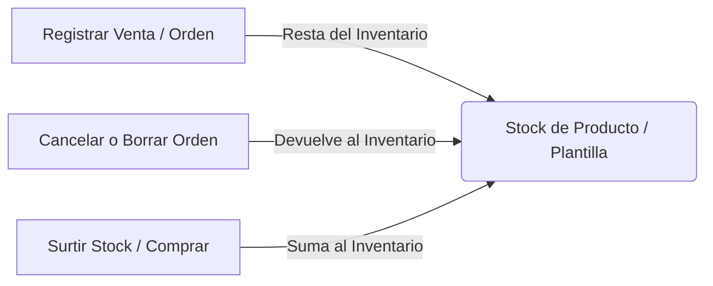

# Manual de Usuario del Sistema de Gestión Comercial y Producción SETH

¡Bienvenido al manual oficial de **SETH**! Este documento está diseñado para acompañarte en el uso diario de la aplicación. Aquí encontrarás explicaciones sencillas, paso a paso, de cada pantalla y botón. No necesitas ser un experto en computación para entenderlo: hemos redactado esta guía con explicaciones muy claras y prácticas para que tú y tu equipo dominen el sistema en poco tiempo.

---

## Índice General

1. [Acceso al Sistema y Gestión de Permisos](#1-acceso-al-sistema-y-gestión-de-permisos)
   - [Pantalla de Inicio de Sesión](#pantalla-de-inicio-de-sesión)
   - [Directorio de Usuarios](#directorio-de-usuarios)
   - [Matriz y Gestión de Permisos](#matriz-y-gestión-de-permisos)
2. [Catálogos Principales](#2-catálogos-principales)
   - [Catálogo de Clientes](#catálogo-de-clientes)
   - [Catálogo de Productos](#catálogo-de-productos)
   - [Catálogo de Proveedores y Columnas Dinámicas](#catálogo-de-proveedores-y-columnas-dinámicas)
3. [Control de Inventario y Stock (¡Nuevo!)](#3-control-de-inventario-y-stock)
   - [¿Cómo funciona el stock en el sistema?](#cómo-funciona-el-stock-en-el-sistema)
   - [Surtir Inventario y Registrar Gasto Automático](#surtir-inventario-y-registrar-gasto-automático)
4. [Plantillas de Producto (Configuraciones Especiales)](#4-plantillas-de-producto-configuraciones-especiales)
5. [Control de Efectivo: Sesiones de Caja](#5-control-de-efectivo-sesiones-de-caja)
   - [Apertura de Turno (Saldo Inicial)](#apertura-de-turno-saldo-inicial)
   - [Operación Diaria y Caja Chica](#operación-diaria-y-caja-chica)
   - [Cierre de Caja y Arqueo (Cuadre de Dinero)](#cierre-de-caja-y-arqueo-cuadre-de-dinero)
6. [Gestión de Presupuestos (Cotizaciones)](#6-gestión-de-presupuestos-cotizaciones)
   - [Creación y Edición de Cotizaciones](#creación-y-edición-de-cotizaciones)
   - [Envío de Presupuesto por WhatsApp (Generación de Imagen)](#envío-de-presupuesto-por-whatsapp-generación-de-imagen)
   - [Conversión Directa a Orden de Trabajo](#conversión-directa-a-orden-de-trabajo)
7. [Órdenes de Trabajo (Pedidos Formales)](#7-órdenes-de-trabajo-pedidos-formales)
   - [Registro de Orden y Cálculo de Medidas ($m^2$)](#registro-de-orden-y-cálculo-de-medidas-m2)
   - [Historial de Órdenes Completadas](#historial-de-órdenes-completadas)
8. [Órdenes Rápidas (Mostrador y Ventas de Paso)](#8-órdenes-rápidas-mostrador-y-ventas-de-paso)
   - [Registro Rápido y Atajos de Teclado](#registro-rápido-y-atajos-de-teclado)
   - [Impresión de Pendientes de Cobro](#impresión-de-pendientes-de-cobro)
9. [Gestión de Pagos y Abonos](#9-gestión-de-pagos-y-abonos)
   - [Registrar Abonos a Órdenes o Pagos Libres](#registrar-abonos-a-órdenes-o-pagos-libres)
   - [Impresión de Bitácora de Pagos](#impresión-de-bitácora-de-pagos)
10. [Bitácora de Impresión y Plotters (Área de Producción)](#10-bitácora-de-impresión-y-plotters-área-de-producción)
    - [Cola de Producción (Mostrador vs. Maquila)](#cola-de-producción-mostrador-vs-maquila)
    - [Alerta de Retraso (Parpadeo Rojo)](#alerta-de-retraso-parpadeo-rojo)
    - [Flujo de "Listo" e Impresión de Hojas de Trabajo](#flujo-de-listo-e-impresión-de-hojas-de-trabajo)
11. [Órdenes de Compra a Proveedores (Surtido Mayorista)](#11-órdenes-de-compra-a-proveedores-surtido-mayorista)
    - [Creación y Formulario Adaptable](#creación-y-formulario-adaptable)
    - [Detalles, Imagen PNG y WhatsApp](#detalles-imagen-png-y-whatsapp)
12. [Panel de Estadísticas y Gráficas de Ventas](#12-panel-de-estadísticas-y-gráficas-de-ventas)
13. [Guía Práctica para Resolver Problemas (Troubleshooting)](#13-guía-práctica-para-resolver-problemas-troubleshooting)

---

## 1. Acceso al Sistema y Gestión de Permisos

Esta sección explica cómo entrar al programa, cómo dar de alta a tus empleados y cómo controlar lo que cada uno puede ver o modificar.

### Pantalla de Inicio de Sesión
1. Al abrir SETH, verás la pantalla de **Inicio de Sesión**.
2. Escribe tu **Nombre de Usuario** y tu **Contraseña**.
3. Haz clic en el botón azul **Iniciar Sesión**. Si escribiste algo mal, aparecerá un recuadro rojo indicando el error.
4. **Salir de forma segura**: Para cerrar tu sesión y que nadie más use tu cuenta, haz clic en el botón **Cerrar Sesión** (de color rojo) en la esquina superior derecha del menú. Esto te regresará a la pantalla de entrada.

### Directorio de Usuarios
Ubicado en el menú de la izquierda, en la opción **Usuarios**. Aquí puedes registrar a las personas que trabajarán con el sistema.
* **Crear un nuevo usuario**:
  1. Haz clic en el botón **Nuevo Usuario (+)** (esquina superior derecha).
  2. Llena los campos: **Nombre de usuario**, ingresa una **Contraseña** (mínimo 6 letras o números), y selecciona un **Rol** (por ejemplo: Administrador, Cajero, Operador).
  3. Haz clic en **Guardar**.
* **Editar un usuario**:
  1. En la lista, busca al usuario y haz clic en el botón **Editar** (el icono de lápiz).
  2. Podrás cambiar su nombre o asignarle un rol diferente.
* **Activar o Desactivar**:
  - Los usuarios no se pueden borrar por completo del sistema para no estropear el historial de ventas que ellos hicieron en el pasado. En su lugar, usa el interruptor (switch) de **Activo/Inactivo**. Si desactivas a un usuario, no podrá volver a entrar al sistema.

### Matriz y Gestión de Permisos
Para proteger el dinero y los datos del negocio, puedes decidir qué botones y pantallas puede usar cada empleado.
Ve a la opción **Gestión de Permisos** en el menú de la izquierda.
* **¿Cómo funciona?**: Verás una tabla donde aparecen los permisos del sistema. Puedes activar o desactivar permisos específicos para cada rol de usuario.
* **Permisos clave que debes cuidar**:
  - `Crear/Editar/Eliminar Presupuestos`: Permite o bloquea el control de las cotizaciones.
  - `Crear/Editar Órdenes`: Permite registrar pedidos formales de clientes.
  - `Registrar/Eliminar Pagos`: Controla quién puede registrar abonos de dinero.
  - `Ver Mayoristas` / `Crear Orden Mayorista`: Acceso a las compras externas para proveedores.
  - `Estadísticas: Filtros` vs. `Estadísticas: Hoy`: Si un empleado tiene activado `Estadísticas: Hoy`, **sólo podrá ver las ventas que se han hecho el día de hoy** en las gráficas; no podrá ver el historial de meses o años anteriores. Esto protege la información financiera confidencial.

---

## 2. Catálogos Principales

Los catálogos son la "biblioteca" de información de tu negocio. Debes registrar aquí a tus clientes, productos y proveedores antes de empezar a hacer cotizaciones o ventas.

### Catálogo de Clientes
Ubicado en la sección **Clientes** del menú izquierdo.
* **Registrar Cliente**:
  1. Haz clic en **Nuevo Cliente**.
  2. Llena la información:
     - **Nombre**: Nombre completo o el nombre del negocio del cliente.
     - **Teléfono**: Escribe el número celular a **10 dígitos corridos** (ejemplo: `5512345678`), sin espacios ni guiones. *Esto es fundamental para que funcione el envío de mensajes por WhatsApp.*
     - **Correo Electrónico**: Su dirección de correo (opcional).
     - **Color del Círculo (Nivel de Cliente)**: Selecciona una etiqueta de color (**Verde**, **Amarillo** o **Rojo**). Esto te sirve para identificar visualmente a tus clientes (por ejemplo: Verde para clientes frecuentes, Amarillo para intermediarios, Rojo para clientes difíciles o con adeudos).
  3. Haz clic en **Guardar**.
* **Escribirle por WhatsApp al instante**:
  - Al lado de cada cliente en la lista verás un botón verde con el logotipo de **WhatsApp**. Al hacer clic, el sistema abrirá automáticamente una pestaña de chat directo en WhatsApp Web usando el teléfono del cliente (agregándole el código de país de México `52`), lo que te permite escribirle sin necesidad de registrarlo en tu celular.

### Catálogo de Productos
Ubicado en la opción **Productos** del menú de la izquierda. Aquí das de alta lo que vendes.
* **Registrar Producto**:
  1. Haz clic en **Nuevo Producto**.
  2. Llena los datos:
     - **Nombre**: (Ejemplo: *Lona Front*, *Vinil Auto-adherible*, *Taza Sublimada*).
     - **Precio Base**: El precio de venta regular al público.
     - **Precio Promoción** / **Precio con Descuento**: Precios especiales alternativos. El sistema tomará automáticamente el menor de los tres precios activos al vender.
     - **Precio de Compra** (¡Nuevo!): Escribe cuánto te cuesta a ti comprar o producir este artículo. Este campo es privado (el cliente no lo ve) y te ayudará a conocer tus ganancias reales.
     - **Categoría**: Agrupa tus productos para encontrarlos rápido (ej. *Impresión Gran Formato*, *Artículos Promocionales*).
  3. Haz clic en **Guardar**.
* **Galería de Fotos**: Al entrar al detalle de un producto (haciendo clic en su nombre), verás una sección para subir imágenes. Esto es ideal para guardar fotos de trabajos reales ya terminados de ese producto, sirviendo de catálogo visual para tus clientes o de guía de referencia para tus diseñadores.

### Catálogo de Proveedores y Columnas Dinámicas
Ubicado en la pestaña **Directorio de Proveedores** dentro de la sección **Proveedores**.
* **Registrar Proveedor**:
  1. Haz clic en **Nuevo Proveedor**.
  2. Ingresa su **Nombre**, **Teléfono**, **Correo** y una breve descripción.
  3. **Columnas Personalizadas (Muy Importante)**: Aquí debes escribir, separados por comas, los datos que te pide ese proveedor específico para levantarle un pedido.
     - *Ejemplo*: Si tu proveedor de lonas te pide piezas, ancho, alto y acabados, escribe: `piezas, ancho, alto, ojillos, costura`.
     - Si tu proveedor de uniformes te pide cantidad, talla y color, escribe: `cantidad, talla, color`.
     - *¿Para qué sirve esto?* El sistema creará un formulario inteligente y exclusivo para este proveedor que se adaptará automáticamente a estos campos cuando le hagas una orden de compra.

---

## 3. Control de Inventario y Stock

El sistema cuenta con un moderno y automatizado control de existencias (Stock) e inventario para evitar pérdidas de material y llevar las cuentas claras.

### ¿Cómo funciona el stock en el sistema?

El inventario de tus **Productos** y **Plantillas de Producto** se ajusta de forma inteligente y automática según las operaciones diarias del negocio:

* **Al crear una Orden de Trabajo**: En cuanto registras y guardas una venta formal con productos o plantillas, el sistema **resta automáticamente** las cantidades vendidas del stock disponible de esos artículos.
* **Al cancelar o eliminar**: Si el cliente cancela el trabajo y tú cambias el estado de la orden a "Cancelado" (o si eliminas la orden por completo), el sistema **regresa (restablece) de forma automática** los artículos al inventario para que tus existencias físicas no se descuadren.
* **Al modificar la orden**: Si editas una orden de trabajo abierta para cambiar las cantidades o quitar artículos, el sistema suma de vuelta las piezas anteriores y resta las nuevas de manera transparente.

### Surtir Inventario y Registrar Gasto Automático
Cuando te llegue mercancía o material nuevo, debes registrar la entrada en el sistema para actualizar tu stock y, al mismo tiempo, justificar el dinero que salió de la caja para pagar ese material.

**Pasos para surtir stock:**
1. Ve a **Productos** y haz clic en el nombre del producto que vas a surtir.
2. En la tarjeta de información verás el cuadro **Stock disponible**. Haz clic en el botón **Surtir Stock** (en las plantillas verás un botón que dice **Surtir**).
3. Se abrirá una ventana emergente:
   - **Cantidad a agregar**: Escribe el número de piezas, metros o unidades que están entrando al almacén (debe ser mayor a 0).
   - **Precio de Compra Unitario**: El sistema te sugerirá el costo registrado, pero puedes modificarlo si el proveedor cambió su precio para esta compra.
   - **Costo Total (Gasto)**: Se calcula multiplicando la cantidad por el precio unitario. Puedes sobrescribir este total de forma manual si te hicieron un descuento especial o si pagaste un extra de envío.
   - **Notas / Descripción**: Agrega una nota breve (ej. *"Compra de 2 rollos de lona a Proveedor Distribuidor"*).
4. Haz clic en **Surtir Inventario**.

> [!IMPORTANT]
> **Integración con la Caja Chica**:
> Al hacer clic en "Surtir Inventario", el sistema realiza dos acciones en un solo paso:
> 1. Suma la cantidad de artículos al stock del producto o plantilla.
> 2. **Registra automáticamente un Gasto (Egreso)** en tu turno de caja activo por el **Costo Total** de la compra.
> 
> *Nota:* Para poder surtir inventario, **es obligatorio tener una sesión de caja abierta**. Si la caja está cerrada, el sistema te mostrará una advertencia y no te dejará guardar, ya que todo dinero invertido en mercancía debe quedar registrado en el flujo diario de caja.

---

## 4. Plantillas de Producto (Configuraciones Especiales)

Las **Plantillas de Producto** son "recetas predefinidas" para simplificar la venta de artículos complejos o personalizados que vendes muy seguido.

* **¿Para qué sirven?**: Evitan que tengas que calcular dimensiones, acabados, precios de compra o precios de venta manualmente cada vez que atiendes a un cliente.
* **Ejemplo práctico**: Tienes el producto base "Lona Front". Pero vendes muy seguido un paquete que incluye "Lona Front de 3x2 metros, con ojillos perimetrales y bastilla reforzada". Puedes crear una plantilla llamada "Lona Publicitaria Grande (3x2m)".
* **Campos que almacena**: Medidas de alto y ancho fijas, categoría, modelo, si se vende por paquete (con piezas por empaque), precio de venta final, precio de compra y su propio **Stock de inventario independiente**.
* **Uso al vender**: Al crear un presupuesto o una orden de trabajo, simplemente buscas la plantilla por su nombre en el buscador. El sistema rellenará al instante el formulario con las medidas, precios y detalles preestablecidos, ahorrándote valiosos minutos en mostrador.

---

## 5. Control de Efectivo: Sesiones de Caja

La caja chica controla el flujo de dinero en efectivo de la tienda. **Es obligatorio tener un turno de caja abierto para poder cobrar abonos, registrar gastos o surtir inventario.**

### Apertura de Turno (Saldo Inicial)
1. Si intentas realizar un cobro o registrar un abono con la caja cerrada, el sistema te mostrará un mensaje indicando que debes abrir turno.
2. Ve a la opción **Sesión de Caja** en el menú izquierdo.
3. Haz clic en el botón **Abrir Turno**.
4. Escribe el **Monto Inicial** en efectivo (el fondo o "cambio" que dejas físicamente en el cajón de dinero al iniciar el día).
5. Confirma la acción. La caja cambiará a estado **Abierta**.

### Operación Diaria y Caja Chica
Mientras la caja esté abierta, la pantalla de **Sesión de Caja** te mostrará en tiempo real un resumen matemático exacto:
* **Fondo de Caja (Monto Inicial)**: El efectivo con el que abriste el turno.
* **Total Ingresos**: Todo el dinero que ha entrado por abonos de clientes, liquidaciones de órdenes rápidas o cobros libres.
* **Total Gastos/Egresos**: Todo el dinero que ha salido (compras de material por surtido de stock, compras de papelería, pago de agua, etc.).
* **Saldo Esperado**: El cálculo automático: `Fondo Inicial + Ingresos - Gastos`. Es el dinero exacto que debería haber físicamente en el cajón.

### Cierre de Caja y Arqueo (Cuadre de Dinero)
Al terminar la jornada laboral o el turno del cajero, se debe hacer el arqueo (contar el dinero físico en billetes y monedas) para cerrar la caja chica:

1. Ve a **Sesión de Caja** y haz clic en **Cerrar Turno**.
2. Verás una pantalla que te muestra el **Saldo Esperado** calculado por el sistema.
3. En el campo **Monto Real (Efectivo Físico)**, escribe la cantidad exacta de dinero en efectivo que contaste físicamente en el cajón.
4. **Advertencias por descuadre**:
   - Si lo que contaste físicamente es menor o mayor a lo que la computadora calcula, se encenderá un recuadro de advertencia en color naranja o rojo avisando que hay un **faltante** o **sobrante** de dinero.
5. **Notas de Cierre obligatorias**:
   - Si existe alguna diferencia de dinero (aunque sea de $1 peso), **el botón para cerrar se bloqueará**. Para desbloquearlo, debes escribir de forma obligatoria una explicación en el campo de notas (ejemplo: *"Falta de cambio de $20 pesos"* o *"Arqueo correcto"*). Una vez que escribas la justificación, el botón **Confirmar Cierre** se habilitará.
6. Haz clic en **Confirmar Cierre**. La sesión se guardará en el historial histórico de auditoría.

---

## 6. Gestión de Presupuestos (Cotizaciones)

El módulo de presupuestos te permite cotizar precios a tus clientes de forma formal sin que se reste material del inventario, sin que se mande a imprimir nada en plotters y sin afectar tu caja de dinero.

### Creación y Edición de Cotizaciones
1. Ve a **Presupuestos** en el menú y haz clic en **Nuevo Presupuesto**.
2. Escribe y selecciona al **Cliente** (si no existe, debes darlo de alta en el catálogo primero).
3. Agrega los artículos buscando por **Productos** o por **Plantillas**. Escribe la cantidad.
4. *Precio especial*: El sistema cargará el precio regular del catálogo. Si le vas a dar un descuento especial a este cliente, puedes borrar el precio unitario sugerido y escribir uno menor.
5. Haz clic en **Guardar Presupuesto**.

> [!NOTE]
> Para evitar errores y mantener la congruencia de tus registros, si un presupuesto ya fue convertido en una Orden de Trabajo real, **el sistema bloqueará su edición**. Ya no podrás cambiarlo porque el pedido ya está en producción.

### Envío de Presupuesto por WhatsApp (Generación de Imagen)
SETH cuenta con una innovadora herramienta para enviar cotizaciones limpias, formales y visualmente atractivas directamente a los chats de WhatsApp de tus clientes.

1. En la lista de presupuestos, haz clic en el botón verde con el icono de **WhatsApp** correspondiente al presupuesto que quieres enviar.
2. Se abrirá una ventana que te muestra un saludo predeterminado, el cual puedes editar libremente.
3. Haz clic en **Generar y Enviar**.
4. **¿Qué hace el sistema internamente?**:
   - Toma los datos del presupuesto (productos, precios, total y el número de cotización) y los dibuja en una imagen digital con el diseño oficial de tu empresa.
   - **Sello de Precio Especial**: Si rebajaste los precios para este cliente en comparación con el catálogo regular, el sistema le estampará automáticamente un sello rojo que dice **"USTED HA ADQUIRIDO UN PRECIO ESPECIAL"**.
   - El sistema copia esta imagen directamente al "portapapeles" invisible de tu computadora (es decir, hace un "Copiar" automático) y abre el chat del cliente en WhatsApp Web.
5. **Cómo enviarla (Acción del usuario)**: Haz clic en la barra donde escribes tus mensajes de WhatsApp Web, presiona las teclas **Ctrl + V** (o clic derecho -> Pegar) y presiona la tecla Enter. La cotización se enviará de inmediato como una imagen PNG de alta calidad con el texto de saludo.

> [!TIP]
> **¿Qué pasa si mi navegador bloquea el portapapeles?**
> Por motivos de seguridad de algunos navegadores, a veces el pegado automático (`Ctrl + V`) no funciona. **No te preocupes.**
> SETH tiene un respaldo automático: en cuanto haces clic en "Generar y Enviar", la imagen se descarga de forma invisible en la carpeta de **Descargas** de tu computadora (con un nombre como `presupuesto-15.png`). Si `Ctrl + V` no pega nada, simplemente arrastra el archivo de imagen descargado hacia el chat de WhatsApp Web, o haz clic en el icono de archivos adjuntos (el clip o el botón `+` en WhatsApp), selecciona el archivo y envíalo.

### Conversión Directa a Orden de Trabajo
Si el cliente acepta el presupuesto, no tienes que volver a escribir todo el pedido:
1. En la lista de presupuestos, haz clic en el botón **Convertir a Orden** (icono de flecha hacia la derecha).
2. Confirma la acción. El sistema copiará automáticamente todos los datos del cliente, los artículos y los precios para crear una **Orden de Trabajo** activa, ahorrándote tiempo y evitando errores de dedo. El presupuesto original cambiará a estado "Convertido".

---

## 7. Órdenes de Trabajo (Pedidos Formales)

Las órdenes de trabajo representan las ventas confirmadas que tus clientes ya pagaron o prometieron pagar y que tu taller debe fabricar o entregar.

### Registro de Orden y Cálculo de Medidas ($m^2$)
1. Ve a **Ordenes** en el menú de la izquierda y haz clic en **Nueva Orden**.
2. Selecciona al **Cliente**.
3. Elige al **Responsable del Trabajo**:
   - **Mostrador**: Si el trabajo se hace rápido dentro del local o se entrega de inmediato.
   - **Maquila**: Si el trabajo requiere procesos externos (proveedores mayoristas) o si es para un distribuidor grande.
4. Selecciona la **Fecha Estimada de Entrega** (día y hora aproximada).
5. Agrega los productos. Para artículos cobrados por medidas (como lonas, viniles o espectaculares):
   - Escribe el **Ancho** y el **Alto** en metros (ejemplo: ancho `2.50`, alto `1.20`).
   - El sistema calculará los metros cuadrados automáticamente, los multiplicará por el precio unitario y te dará el total exacto.
6. Agrega notas e indicaciones específicas para el área de producción en el cuadro de texto.
7. Haz clic en **Guardar Orden**. *En este momento, el stock de los productos utilizados se restará de forma automática.*

### Historial de Órdenes Completadas
Una vez que el pedido es fabricado y entregado al cliente, se marca como completado y se archiva en la sección **Historial** del menú de la izquierda.
* **Búsqueda Inteligente**: Puedes buscar órdenes archivadas escribiendo en la barra de búsqueda el número de orden, el nombre del cliente, su teléfono o incluso el nombre del producto vendido.
* **Desplazamiento Infinito**: Para no saturar tu computadora con miles de registros viejos, el historial carga de 10 en 10. Para ver más órdenes antiguas, simplemente desplázate hacia abajo en la pantalla y verás cómo aparecen más automáticamente de forma infinita.
* **Corregir errores de estado (Reapertura)**: Si marcaste una orden como completada por error y la quieres regresar al área de producción activa:
  1. Busca la orden en la pantalla de **Historial**.
  2. Haz clic en **Editar** y cambia su estado a "Pendiente" o "En Proceso".
  3. Al guardar, la orden desaparecerá del historial y regresará automáticamente a la lista de órdenes activas de la bitácora de plotters.

---

## 8. Órdenes Rápidas (Mostrador y Ventas de Paso)

Este módulo está diseñado para registrar ventas rápidas de mostrador que no requieren cálculos de metros cuadrados ni dar de alta fichas de cliente completas (ejemplo: copias, impresiones sencillas, engargolados o venta de material sobrante).

### Registro Rápido y Atajos de Teclado
1. Ve a **Órdenes Rápidas** y haz clic en **Nueva Orden Rápida**.
2. Llena los datos básicos:
   - **Cliente (Opcional)**: Escribe un nombre rápido (ej. *"Señora de las copias"*) o déjalo vacío para ventas generales.
   - **Teléfono (Opcional)**: Por si necesitas llamarle cuando su trabajo de mostrador esté listo.
   - **Concepto / Descripción (Obligatorio)**: Escribe lo que le estás cobrando (ej. *"15 copias a color y 1 engargolado"*).
   - **Total a Cobrar (Obligatorio)**: El costo total de la compra.
   - **Abono Inicial (Opcional)**: Lo que te entrega en ese momento. Si te paga todo de una vez, escribe la misma cantidad del total.
   - **Método de Pago**: Se activa si el abono es mayor a 0 (Efectivo, Tarjeta, Transferencia u Otro).
3. Haz clic en **Guardar Orden**.

* **Atajos de Teclado para agilizar el cobro**:
  - **Guardar rápido con Enter**: Cuando termines de escribir el concepto en el cuadro de texto de descripción, simplemente presiona la tecla **Enter** en tu teclado. Si completaste los campos obligatorios, el formulario se guardará automáticamente sin necesidad de usar el ratón.
  - **Saltar de línea**: Si deseas escribir varios renglones en la descripción sin que se guarde la orden, presiona las teclas **Shift + Enter** juntas.

### Impresión de Pendientes de Cobro
En la esquina superior de la pantalla de Órdenes Rápidas verás el botón **Imprimir Pendientes**. Al hacer clic, el sistema generará una hoja limpia lista para imprimirse con una lista de los clientes de mostrador que aún te deben dinero. Es ideal para que el cajero revise rápidamente a quién cobrarle al final del día.

---

## 9. Gestión de Pagos y Abonos

Lleva un registro claro de cada peso que entra a tu negocio. Una orden de trabajo o venta rápida puede recibir abonos parciales hasta quedar liquidada por completo.

### Registrar Abonos a Órdenes o Pagos Libres
1. Ve a la sección **Pagos** del menú de la izquierda.
2. Haz clic en el botón **Nuevo Pago**.
3. Selecciona el tipo de cobro que harás:
   - **Vincular a Orden**: Usa el buscador para seleccionar la orden de trabajo activa que el cliente va a pagar. El sistema te mostrará cuánto costó la orden, cuánto ha pagado antes y cuánto debe todavía.
   - **Pago Libre (Sin Orden)**: Elige esto para registrar entradas de dinero extra que no provienen de una orden de trabajo (ejemplo: cobro por la venta de cartón/basura de plotters, renta de un espacio, etc.).
4. Escribe el **Monto del Pago** (la cantidad de dinero que estás recibiendo).
5. Selecciona el **Método de Pago** (Efectivo, Transferencia, Tarjeta o Crédito/Otro).
6. **Concepto / Info**: Describe brevemente de qué es el pago. *Si elegiste "Pago Libre", escribir esta nota es obligatorio para justificar la entrada de efectivo.*
7. Haz clic en **Guardar**. El dinero entrará al saldo de tu sesión de caja chica activa.

### Impresión de Bitácora de Pagos
Haz clic en el botón **Bitácora** (el icono de libro abierto) en la pantalla de pagos para generar reportes financieros:

1. **Tipo de Reporte**:
   - **Pagos Recibidos**: Genera un informe detallado de todo el dinero cobrado. Puedes filtrarlo para ver sólo los pagos hechos en efectivo, tarjeta o transferencia.
   - **Pagos Pendientes**: Crea una lista organizada de los clientes que tienen adeudos (saldos mayores a $0.01 centavos).
2. **Selección de Rango de Fechas**:
   - Puedes usar filtros rápidos como **Hoy**, **Ayer**, **Esta semana** (desde el lunes), **Este mes** (desde el día 1) o **Todo**.
   - O bien, selecciona en el calendario un día específico (**Un día**) o un período personalizado (**Desde / Hasta**).
3. **Previsualización**: En la parte inferior verás la suma total del dinero cobrado antes de imprimir, sirviendo como un arqueo virtual rápido.
4. **Impresión**: Haz clic en **Imprimir Bitácora** para mandar el reporte en formato PDF o papel a tu impresora.

---

## 10. Bitácora de Impresión y Plotters (Área de Producción)

Esta pantalla (opción **Bitácora de Impresión** en el menú de la izquierda) está diseñada especialmente para los operadores de maquinaria y diseñadores en el taller de producción.

### Cola de Producción (Mostrador vs. Maquila)
La pantalla tiene dos pestañas principales:
* **Bitácora Actual**: Muestra los trabajos que están pendientes de imprimirse o entregarse hoy.
* **Historial de Impresiones**: Registros de los trabajos que ya se entregaron.
* **Columnas de Prioridad**:
  - **Most (Mostrador)**: Tiene una marca visual rápida si es un trabajo urgente para entregar a un cliente que espera en tienda.
  - **Maq (Maquila)**: Indica si es un pedido de mayoreo que requiere acabados o envíos externos especiales.

### Alerta de Retraso (Parpadeo Rojo)
Para evitar que se te pase el tiempo de entrega prometido al cliente, el sistema cuenta con una alerta visual de emergencia:
* Si la hora de entrega configurada para un trabajo ya pasó y el operador aún **no** lo ha marcado como terminado, **toda la fila de ese pedido en la tabla comenzará a parpadear con un fondo color rojo brillante de forma infinita**.
* Esto le avisa al instante al operador de plotters que ese trabajo lleva retraso y debe meterlo a la fila de impresión de inmediato.

### Flujo de "Listo" e Impresión de Hojas de Trabajo
* **Checkbox "Listo"**: Cuando el operador termina de imprimir y terminar la lona o vinil, sólo debe marcar la casilla en la columna **Listo**. En ese momento, el pedido desaparece de la bitácora activa para no hacer bulto y se archiva en el historial de impresiones.
* **Imprimir Hojas de Trabajo**: En la cabecera de cada fecha de la bitácora verás el botón **Imprimir**. Al presionarlo, el sistema genera una hoja de control física con los nombres de archivo de diseño, medidas de impresión, materiales y especificaciones de acabados de ese día para entregársela en papel a los operadores de plotters.

---

## 11. Órdenes de Compra a Proveedores (Surtido Mayorista)

Esta sección sirve para levantar pedidos de maquila o insumos especiales a tus proveedores externos.

### Creación y Formulario Adaptable
1. Ve a **Proveedores** -> pestaña **Órdenes de Compra** -> haz clic en **Nueva Orden de Proveedor**.
2. Selecciona al **Proveedor**.
3. **Formulario Inteligente**:
   - Al seleccionar al proveedor, el formulario se modificará automáticamente. Cargará los campos personalizados que diste de alta en la ficha del proveedor (Sección 2).
   - *Ejemplo*: Si es tu maquilador de lonas, te aparecerán casillas para escribir ancho, alto y ojillos. Si es tu proveedor de camisas, te pedirá tallas y colores.
4. **Vincular a Orden de Cliente (Opcional)**: Puedes seleccionar a qué pedido de cliente corresponde esta compra, para saber exactamente a quién pertenece la mercancía cuando el repartidor la traiga.
5. Haz clic en **Guardar**.

### Detalles, Imagen PNG y WhatsApp
En la tabla de pedidos, haz clic en el botón de **Detalles** (icono de ojo) para ver el resumen de la orden de compra. En la parte inferior tendrás herramientas ideales para enviar el pedido:

1. **Imprimir / PDF**: Genera un documento en blanco y negro para imprimir o archivar digitalmente.
2. **Guardar Imagen (PNG Nítido)**: Descarga una foto digital clara de la orden de compra, con un formato limpio y nítido para que puedas mandarla por correo electrónico.
3. **Enviar por WhatsApp al Proveedor**:
   - Al hacer clic, el sistema genera la imagen de la orden, **la copia automáticamente al portapapeles de tu computadora** y te abre el chat de WhatsApp Web con el número del proveedor.
   - **Acción del usuario**: Sólo ve al chat que se abrió, presiona **Ctrl + V** (pegar) en tu teclado y presiona enviar. El proveedor recibirá la lista del pedido en una imagen limpia y legible de forma inmediata.

---

## 12. Panel de Estadísticas y Gráficas de Ventas

El panel de **Gráficas de Ventas** es la herramienta del dueño del negocio para analizar cómo van las finanzas sin enredarse con números complejos.

* **Gráficas Visuales**:
  - *Ventas por Tiempo (Barra Azul)*: Te muestra cuánto dinero se ha facturado día a día en el período seleccionado.
  - *Top Productos en Ingresos (Barra Verde)*: Cuáles son los 10 productos que más dinero de ganancia le traen al negocio.
  - *Top Productos en Cantidad (Barra Naranja)*: Cuáles son los 10 productos que más unidades o metros se venden.
* **Filtros Sencillos**: Puedes ver los datos por semana, por mes, por año o seleccionar días específicos del calendario. También puedes filtrar para ver sólo las ventas de mostrador (órdenes rápidas) o las de plotters (órdenes de trabajo).
* **Filtro de Método de Pago**:
  - Si filtras por un método de pago (por ejemplo, *Transferencia*), el sistema te mostrará una advertencia amarilla aclarando que el total de las gráficas reflejará el costo total de las órdenes que se pagaron por esa vía, no sólo los anticipos parciales.
* **Imprimir Reporte Ejecutivo**: Haz clic en el botón de **Imprimir** en la barra superior y el sistema te generará un reporte horizontal limpio con todas las gráficas acomodadas para imprimir en papel o guardar en formato PDF para juntas.

---

## 13. Guía Práctica para Resolver Problemas (Troubleshooting)

Aquí tienes soluciones rápidas a las dudas y pequeños problemas técnicos que podrían surgirte durante el día a día.

### A. Problemas de Inicio de Sesión y Usuarios
* **El sistema no hace nada al hacer clic en "Iniciar Sesión" o da un error en rojo.**
  - *Causa*: Estás escribiendo mal el nombre de usuario o la contraseña, o tu cuenta fue desactivada por el administrador.
  - *Solución*: Revisa que no tengas activado el Bloqueo de Mayúsculas (`Bloq Mayús`) en tu teclado. Si estás seguro de escribirla bien, pídele a un administrador que entre a la pantalla de **Usuarios** y revise si tu cuenta está en estado "Activo".
* **Quiero borrar un usuario pero no veo el botón de eliminar.**
  - *Causa*: Por seguridad contable, no se permite borrar usuarios para no dejar huérfanas las ventas que hicieron en el pasado.
  - *Solución*: Edita el perfil del usuario y desactiva el interruptor de estado. Con eso, el usuario ya no podrá ingresar a la aplicación pero sus registros del pasado se guardarán con su nombre.

### B. Dudas sobre la Caja Chica y Dinero
* **El sistema me arroja un error y no me deja hacer un cobro o registrar un abono.**
  - *Causa*: Intentaste cobrar con la caja cerrada.
  - *Solución*: Ve a **Sesión de Caja**, haz clic en **Abrir Turno** e introduce tu saldo inicial en efectivo.
* **Me aparece una advertencia en rojo/naranja al querer cerrar el turno y no me deja dar clic en Confirmar Cierre.**
  - *Causa*: El efectivo físico real que contaste en el cajón de dinero no coincide con el balance que calculó la computadora (Saldo Esperado). Para evitar cierres descuadrados sin justificación, el botón se bloquea.
  - *Solución*: Escribe de forma obligatoria una explicación en el campo de notas (ejemplo: *"Falta de cambio de $20 pesos"* o *"Se compraron refrescos para el taller"*). En cuanto escribas cualquier texto que justifique la diferencia, el botón **Confirmar Cierre** se desbloqueará para que termines tu turno.
* **Quiero agregar stock a un producto o plantilla pero el sistema me da error.**
  - *Causa*: Tienes la sesión de caja cerrada. Recuerda que al surtir inventario, el sistema registra de forma automática un gasto en la caja chica por el costo de la mercancía.
  - *Solución*: Abre el turno de la caja chica primero en **Sesión de Caja** y luego realiza el surtido de stock.

### C. Dudas sobre Stock e Inventario
* **¿Por qué cambió el stock de un producto si yo no lo he surtido?**
  - *Causa*: Al guardar una orden de trabajo real de un cliente, el sistema resta las piezas en automático. Si la orden se cambia a "Cancelado" o se elimina, las piezas se devuelven de inmediato al inventario.
* **¿Qué hago si quiero registrar que compré material pero no quiero que afecte a la caja de dinero?**
  - *Causa*: SETH está diseñado para mantener una contabilidad real. Toda entrada de mercancía que cueste dinero debe registrarse como un egreso de caja chica para que el arqueo de efectivo de fin de turno sea correcto.
  - *Solución*: Si el material fue un regalo o se pagó con dinero ajeno a la caja chica de la tienda, registra el surtido de stock colocando el **Costo Total** en `$0.00` en la ventana de surtido. Así el stock aumentará sin generar egresos en tu sesión de caja.

### D. Dudas sobre Cotizaciones y Envío por WhatsApp
* **Al dar clic en enviar cotización por WhatsApp, no se abre el chat del cliente.**
  - *Causa*: El número telefónico del cliente en el catálogo está incompleto o tiene caracteres extraños (guiones, espacios, paréntesis).
  - *Solución*: Ve a **Clientes**, edita la ficha del cliente y asegúrate de que el teléfono tenga exactamente 10 números corridos sin ningún otro carácter (ejemplo: `5512345678`).
* **Presiono Ctrl + V (Pegar) en WhatsApp Web pero no aparece la imagen de la cotización o se pega otra cosa.**
  - *Causa*: El navegador de internet (Chrome, Edge, Firefox) bloquea la copia automática en el portapapeles debido a configuraciones de seguridad de tu computadora.
  - *Solución*: No te preocupes. Cuando haces clic en el botón de WhatsApp, el sistema descarga automáticamente la imagen a tu computadora. Busca en tu carpeta de **Descargas** un archivo llamado `presupuesto-[Número].png` y arrástralo directamente al chat de tu cliente en WhatsApp Web, o mándalo como un archivo adjunto usando el icono de clip (`+`).

### E. Dudas sobre Plotters y Producción
* **Una fila en la Bitácora de Impresión parpadea en color rojo brillante.**
  - *Causa*: La hora de entrega prometida al cliente ya se venció y el trabajo aún no está marcado como "Listo".
  - *Solución*: Imprime el trabajo con prioridad. Una vez terminado y revisado, haz clic en la casilla **Listo** de la fila para apagar el parpadeo y archivarlo.
* **Marqué una orden como "Listo" por error en la Bitácora y desapareció. ¿Cómo la recupero?**
  - *Causa*: Al marcar la casilla "Listo", el sistema traslada el trabajo de la lista activa al **Historial de Impresiones** para mantener limpia la pantalla de producción.
  - *Solución*: Ve a la pestaña **Historial de Impresiones** en la bitácora de impresión, localiza el trabajo y desmarca la casilla "Listo". La orden regresará al instante a la lista de trabajos activos.

### F. Problemas Técnicos y Base de Datos
* **Al iniciar el programa me sale un error de conexión a la Base de Datos.**
  - *Causa*: Si tu sistema está configurado para usar base de datos en red (PostgreSQL), podría haber un fallo de conexión a internet o de red local. Si está configurado localmente (SQLite), puede haber un problema de permisos en la carpeta del archivo.
  - *Solución*: 
    1. Revisa que tu computadora tenga conexión estable a la red/internet.
    2. Asegúrate de que el archivo de configuración `.env` en la carpeta del programa tenga el tipo de base de datos (`DB_TYPE=sqlite` para uso local sencillo o `DB_TYPE=postgres` para uso en red) y las credenciales correctas.
    3. Si el problema persiste, reinicia la aplicación. La base de datos realiza comprobaciones y actualizaciones de estructura de forma totalmente automática al iniciar, por lo que no es necesario realizar ningún ajuste manual de código.
