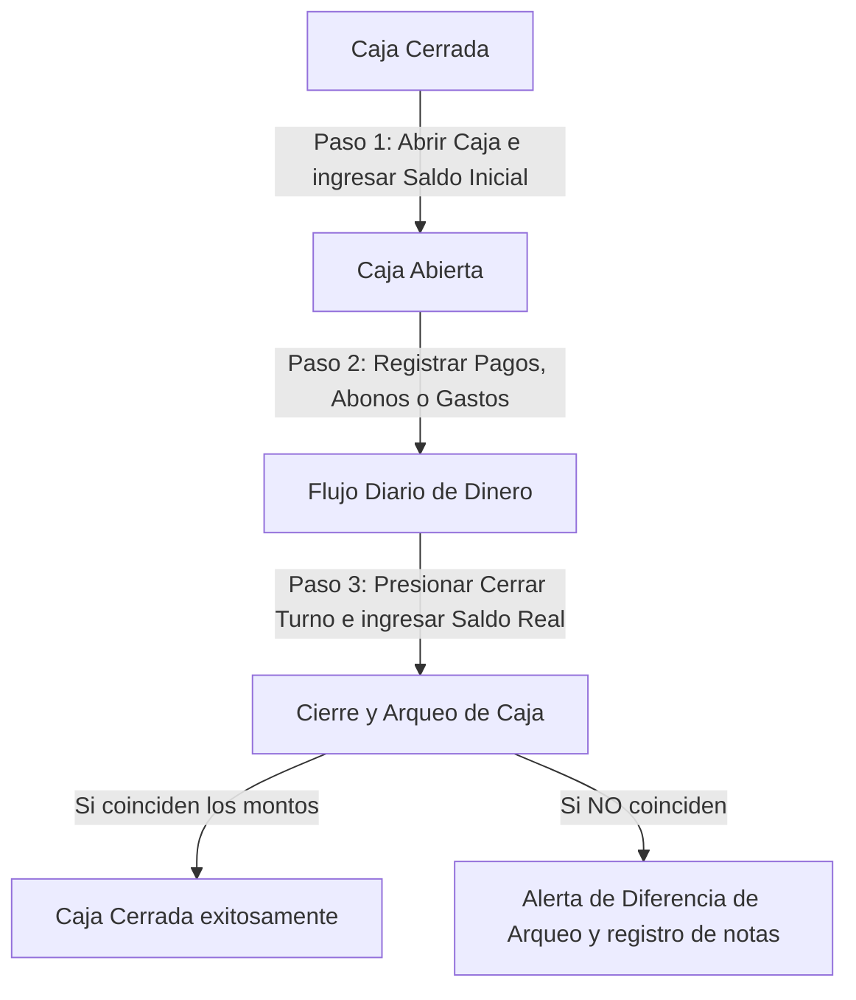

# Manual de Usuario del Sistema de Gestión Comercial y Producción SETH

Bienvenido al manual oficial del sistema de gestión SETH. Este documento tiene como objetivo guiarte detalladamente a través de todas las pantallas, opciones y flujos de trabajo de la aplicación. Ha sido diseñado para ser consultado siempre que tengas dudas sobre el comportamiento de un botón, campo o proceso dentro del sistema.

---

## Índice General

1. [Acceso al Sistema y Gestión de Permisos (Módulo Base)](#1-acceso-al-sistema-y-gestión-de-permisos-módulo-base)
   - [Pantalla de Inicio de Sesión](#pantalla-de-inicio-de-sesión)
   - [Directorio de Usuarios](#directorio-de-usuarios)
   - [Matriz y Gestión de Permisos](#matriz-y-gestión-de-permisos)
2. [Catálogos Principales](#2-catálogos-principales)
   - [Catálogo de Clientes](#catálogo-de-clientes)
   - [Catálogo de Productos](#catálogo-de-productos)
   - [Catálogo de Proveedores / Mayoristas](#catálogo-de-proveedores--mayoristas)
3. [Control de Flujo de Efectivo: Sesiones de Caja](#3-control-de-flujo-de-efectivo-sesiones-de-caja)
   - [Apertura de Caja](#apertura-de-caja)
   - [Operación Diaria e Indicadores](#operación-diaria-e-indicadores)
   - [Cierre de Caja y Arqueo](#cierre-de-caja-y-arqueo)
   - [Historial y Reapertura de Turnos](#historial-y-reapertura-de-turnos)
4. [Plantillas de Producto](#4-plantillas-de-producto)
5. [Gestión de Presupuestos (Cotizaciones)](#5-gestión-de-presupuestos-cotizaciones)
   - [Creación y Edición de Presupuestos](#creación-y-edición-de-presupuestos)
   - [Envío de Presupuesto por WhatsApp (Generación de Imagen en Portapapeles)](#envío-de-presupuesto-por-whatsapp-generación-de-imagen-en-portapapeles)
   - [Conversión Directa a Orden de Trabajo](#conversión-directa-a-orden-de-trabajo)
6. [Órdenes de Trabajo](#6-órdenes-de-trabajo)
   - [Creación y Flujo de Trabajo](#creación-y-flujo-de-trabajo)
   - [Historial de Órdenes Completadas](#historial-de-órdenes-completadas)
7. [Órdenes Rápidas (Mostrador y Ventas de Paso)](#7-órdenes-rápidas-mostrador-y-ventas-de-paso)
   - [Registro de Venta Rápida](#registro-de-venta-rápida)
   - [Atajos de Teclado del Formulario](#atajos-de-teclado-del-formulario)
   - [Impresión de Pendientes Rápidas](#impresión-de-pendientes-rápidas)
8. [Gestión de Pagos y Abonos](#8-gestión-de-pagos-y-abonos)
   - [Registro de Pagos (Vínculo de Órdenes o Pago Libre)](#registro-de-pagos-vínculo-de-órdenes-o-pago-libre)
   - [Impresión de Bitácoras de Pagos (Recibidos y Pendientes)](#impresión-de-bitácoras-de-pagos-recibidos-y-pendientes)
9. [Bitácora de Impresión y Producción](#9-bitácora-de-impresión-y-producción)
   - [Cola de Trabajo (Mostrador vs. Maquila)](#cola-de-trabajo-mostrador-vs-maquila)
   - [Alerta Visual por Entrega Atrasada (Parpadeo Rojo)](#alerta-visual-por-entrega-atrasada-parpadeo-rojo)
   - [Flujo de Marcado como Listo (Completado)](#flujo-de-marcado-como-listo-completado)
   - [Impresión de Bitácoras del Grupo de Producción](#impresión-de-bitácoras-del-grupo-de-producción)
10. [Órdenes de Compra a Proveedores (Surtido Mayorista)](#10-órdenes-de-compra-a-proveedores-surtido-mayorista)
    - [Creación con Columnas Dinámicas](#creación-con-columnas-dinámicas)
    - [Detalles, Exportación a PNG e Integración con WhatsApp](#detalles-exportación-a-png-e-integración-con-whatsapp)
11. [Módulo de Estadísticas y Gráficas de Ventas](#11-módulo-de-estadísticas-y-gráficas-de-ventas)
12. [Guía de Resolución de Errores y Validaciones (Troubleshooting)](#12-guía-de-resolución-de-errores-y-validaciones-troubleshooting)

---

## 1. Acceso al Sistema y Gestión de Permisos (Módulo Base)

Esta sección cubre el acceso principal, la creación y edición de usuarios, y cómo se configuran las restricciones de visibilidad o de acción a través de los roles y permisos.

### Pantalla de Inicio de Sesión
1. Al iniciar la aplicación, se mostrará la pantalla de **Inicio de Sesión (Login)**.
2. Introduce tu **Nombre de Usuario** y **Contraseña** en los campos indicados.
3. Haz clic en el botón **Iniciar Sesión**. En caso de que los datos sean incorrectos, aparecerá una alerta en color rojo describiendo el error.
4. Para salir de tu sesión de forma segura:
   - Ve a la parte superior de la ventana o directamente al menú del **Dashboard**.
   - Presiona el botón **Cerrar Sesión** en color rojo. Esto limpiará las credenciales y regresará a la pantalla de Login.

### Directorio de Usuarios
Ubicado en el menú lateral bajo la sección **Usuarios**. Este módulo permite registrar y modificar la información de las personas autorizadas para utilizar la aplicación.
* **Crear Usuario**:
  1. Presiona el botón **Nuevo Usuario (+)** en la parte superior derecha.
  2. Llena los campos obligatorios: **Nombre de usuario**, **Contraseña** (mínimo 6 caracteres), y selecciona un **Rol** (por ejemplo: Administrador, Cajero, Operador).
  3. Haz clic en **Guardar**.
* **Editar Usuario**:
  1. En la lista de usuarios, localiza al usuario y presiona el botón **Editar** (icono de lápiz).
  2. Podrás cambiar el rol asignado o modificar el nombre de usuario.
* **Activar/Desactivar Usuario**:
  - Los usuarios no se eliminan permanentemente para no romper el historial de ventas creadas. En su lugar, se utiliza un conmutador (switch) o etiqueta de estado **Activo / Inactivo**. Un usuario desactivado no podrá iniciar sesión en el sistema.

### Matriz y Gestión de Permisos
El sistema cuenta con un control de accesos basado en permisos específicos para resguardar la información financiera y operativa.
Ubicado en la barra lateral en **Gestión de Permisos**.
* **Estructura de la Matriz**: Muestra la lista de permisos registrados en el sistema, su ID único y su estado (Activo/Inactivo).
* **Asignar Permisos**: Los botones permiten mapear qué permisos posee cada rol o cuenta individual. Los permisos críticos incluyen:
  - `Crear Presupuestos` / `Editar Presupuestos` / `Eliminar Presupuestos`: Acciones sobre el módulo de cotizaciones.
  - `Crear Órdenes` / `Editar Órdenes`: Permiso para crear o modificar órdenes de trabajo formales.
  - `Registrar Pagos` / `Eliminar Pagos`: Control sobre los flujos de dinero entrante a caja.
  - `Ver Mayoristas` / `Crear Orden Mayorista`: Visualización y generación de pedidos a proveedores externos.
  - `Estadisticas: Filtros` / `Estadisticas: Hoy`: Restricción que define si un usuario puede analizar los gráficos de ventas históricos o si únicamente puede visualizar las ventas del día corriente.

---

## 2. Catálogos Principales

Los catálogos son la base de datos estática del sistema. Deben estar poblados antes de registrar transacciones, ya que los presupuestos, órdenes y bitácoras hacen referencia directa a ellos.

### Catálogo de Clientes
Ubicado en **Clientes** en el menú lateral.
* **Registrar Cliente**:
  1. Presiona el botón **Nuevo Cliente**.
  2. Rellena los campos:
     - **Nombre**: Nombre completo o razón social del cliente.
     - **Teléfono**: Número telefónico a 10 dígitos (crucial para notificaciones automáticas).
     - **Correo Electrónico**: Dirección de correo electrónico de contacto.
     - **Color del Círculo (Nivel de Cliente)**: Permite asignar una etiqueta de color (**Verde**, **Amarillo**, **Rojo**) para distinguir visualmente el nivel de prioridad, volumen de compra o comportamiento del cliente.
  3. Presiona **Guardar**.
* **Integración WhatsApp Directa**:
  - Al lado de la información de cada cliente en la lista, encontrarás un botón verde con el icono de **WhatsApp**. Al presionarlo, el sistema abrirá de forma automática el chat del cliente en WhatsApp Web (usando el número de 10 dígitos registrado, prefijando el código de país `52` de México), permitiéndote enviarle mensajes de forma directa sin necesidad de guardar el contacto en el teléfono.

### Catálogo de Productos
Ubicado en **Productos** en el menú lateral.
* **Registrar Producto**:
  1. Haz clic en **Nuevo Producto**.
  2. Ingresa el **Nombre** del producto (ej: *Lona Front*, *Vinil Brillante*, *Diseño Gráfico*).
  3. Captura el **Precio Base** de venta.
  4. Selecciona o ingresa una **Categoría** para agruparlo.
  5. Guarda los cambios. Estos productos estarán disponibles en las barras de búsqueda de cotizaciones y órdenes de trabajo.

### Catálogo de Proveedores / Mayoristas
Ubicado en la pestaña **Directorio de Proveedores** dentro de la sección **Proveedores** del menú lateral.
* **Configuración del Proveedor**:
  1. Haz clic en **Nuevo Proveedor**.
  2. Llena los campos básicos: **Nombre**, **Teléfono**, **Correo Electrónico** y **Descripción**.
  3. **Columnas Personalizadas (Clave)**: Este campo te permite ingresar los nombres de las columnas que utiliza ese proveedor específico para sus pedidos (ejemplo: `pzas, descripcion, ancho, alto, ojillos, costura` o `cantidad, material, tinta, acabado`).
     - Estas columnas se guardan como una estructura dinámica y se usarán más adelante para construir el formulario de pedido exacto de ese proveedor.
  4. Presiona **Guardar**.

---

## 3. Control de Flujo de Efectivo: Sesiones de Caja

La caja chica controla los turnos de venta de la aplicación. **Es mandatorio contar con una sesión de caja abierta para registrar cualquier tipo de pago (abono) o gasto en el sistema.**

### Apertura de Caja
1. Si la caja está cerrada y se intenta realizar un cobro, el sistema mostrará una advertencia solicitando la apertura del turno.
2. Ve a la sección **Sesión de Caja** en el menú lateral.
3. Presiona el botón **Abrir Turno**.
4. Introduce el **Monto Inicial** en efectivo con el que se cuenta físicamente en la caja chica (fondo de caja para cambio).
5. Confirma la acción. El estado de la caja pasará a **Abierta**, registrando la fecha, hora y el usuario que realizó la apertura.

### Operación Diaria e Indicadores
Mientras la sesión esté abierta, la pantalla principal de **Sesión de Caja** mostrará en tiempo real:
* **Fondo de Caja (Monto Inicial)**: El efectivo con el que se abrió el turno.
* **Total Ingresos**: Dinero acumulado por concepto de abonos, liquidaciones de órdenes o pagos libres.
* **Total Gastos/Egresos**: Dinero retirado de la caja chica para gastos operativos (pago de servicios, papelería, etc.).
* **Saldo Esperado**: Cálculo matemático automático: `Saldo Inicial + Ingresos - Gastos`.

### Cierre de Caja y Arqueo
Al finalizar la jornada laboral o el turno del cajero, se debe proceder al cierre del turno para auditar el dinero físico.
1. Haz clic en el botón **Cerrar Turno**.
2. Aparecerá el modal **Cerrar Sesión de Caja**, el cual te indicará el **Saldo Esperado** calculado por el sistema.
3. Introduce obligatoriamente el **Monto Real (Efectivo Físico)** que hay en el cajón de dinero.
4. **Alerta de Diferencia de Arqueo**:
   - Si el *Monto Real* es diferente al *Saldo Esperado*, el sistema activará automáticamente una advertencia visual destacada en color naranja/rojo avisando que existe un descuadre (sobrante o faltante).
5. Es obligatorio rellenar el campo **Notas / Observaciones de Cierre** explicando el motivo de la diferencia si la hubiera.
6. Haz clic en **Confirmar Cierre**. El turno se guardará en el historial y la caja quedará cerrada para futuras ventas hasta que se vuelva a abrir una nueva sesión.

### Historial y Reapertura de Turnos
En la misma sección de Caja, puedes consultar el historial de turnos pasados. Si cuentas con los permisos administrativos correspondientes, el sistema permite presionar el botón **Reabrir Turno** sobre una sesión cerrada para realizar correcciones de última hora (esto recalculará los balances y reajustará el flujo del arqueo según los nuevos movimientos).

---

## 4. Plantillas de Producto

Las **Plantillas de Producto** sirven para predefinir configuraciones de artículos complejos que se venden de forma recurrente, evitando tener que calcular dimensiones o precios especiales manualmente cada vez.
* **Estructura**: Se ligan a un producto base del catálogo (ej: *Lona front*) y permiten guardar medidas preestablecidas (alto y ancho), acabados específicos o fórmulas de cálculo de costo.
* **Uso**: Al crear un presupuesto o una orden de trabajo, puedes buscar directamente la plantilla en lugar del producto individual, rellenando el formulario de artículos del pedido de forma automática e inmediata con los precios y dimensiones preestablecidos.

---

## 5. Gestión de Presupuestos (Cotizaciones)

El módulo de presupuestos permite realizar cotizaciones a clientes sin comprometer inventarios, crear bitácoras de impresión o registrar flujos de caja.

### Creación y Edición de Presupuestos
1. Ve a **Presupuestos** en la barra lateral y haz clic en **Nuevo Presupuesto**.
2. Selecciona un **Cliente** de la lista de búsqueda.
3. Añade artículos al presupuesto a través de las pestañas **Productos** o **Plantillas**:
   - Captura la **Cantidad**.
   - El sistema cargará el precio unitario base. Puedes modificar manualmente este precio si deseas otorgar un precio preferencial o descuento al cliente para esta cotización específica.
4. Haz clic en **Guardar Presupuesto**.
* *Nota de Restricción*: Si un presupuesto es editado y ya se encuentra marcado como **Convertido a Orden**, el sistema deshabilitará la edición para evitar incongruencias entre lo cotizado e impreso.

### Envío de Presupuesto por WhatsApp (Generación de Imagen en Portapapeles)
SETH cuenta con un sistema avanzado de cotizaciones visuales para enviarse rápidamente por chat.

1. En la lista de presupuestos, haz clic en el botón verde **WhatsApp** del registro que deseas enviar.
2. Se abrirá una ventana emergente que muestra un cuadro de texto con un mensaje predeterminado:
   > *"Le enviamos la cotización solicitada esperamos vernos favorecidos, será un placer colaborar con usted"*
3. Puedes editar este texto de forma libre.
4. Haz clic en el botón **Generar y Enviar**. El sistema realizará lo siguiente de forma interna:
   - Tomará la información del presupuesto (artículos, cantidades, precios unitarios, total e ID del documento) y la incrustará de forma invisible en un formato gráfico pixel-perfect oficial (utilizando el fondo de marca oficial `COTIZACION.jpg`).
   - Si el cliente obtuvo un precio rebajado en comparación con el catálogo base, el sistema estampará de forma automática un sello rojo visible que dice: **"USTED HA ADQUIRIDO UN PRECIO ESPECIAL"**.
   - Si el cliente tiene un círculo de color asignado en su catálogo, este aparecerá dibujado en la imagen.
   - El sistema convertirá esta plantilla en una imagen PNG y **la copiará directamente al portapapeles de tu computadora**. (En caso de que el navegador bloquee el portapapeles por seguridad, la imagen se descargará automáticamente a tu carpeta de descargas como `presupuesto-[ID].png`).
5. Inmediatamente después, el sistema abrirá la ventana de **WhatsApp Web** con el chat del cliente activo.
6. **Acción del Usuario**: En la caja de chat de WhatsApp, presiona las teclas **Ctrl + V** (o clic derecho -> Pegar) y presiona enviar. La imagen con el diseño oficial de la cotización y el texto redactado se enviarán al cliente en segundos.

### Conversión Directa a Orden de Trabajo
Cuando el cliente apruebe la cotización, no es necesario volver a capturar la orden desde cero:
1. En la lista de presupuestos, ubica el registro y presiona el botón **Convertir a Orden** (icono de flecha a la derecha).
2. Confirma en el cuadro de diálogo. El sistema copiará todos los artículos, precios y datos del cliente y los transformará automáticamente en una **Orden de Trabajo** activa, marcando el presupuesto original como "Convertido" (lo que bloquea su futura modificación o duplicación).

---

## 6. Órdenes de Trabajo

Las órdenes de trabajo representan los compromisos comerciales firmes de la empresa. Controlan la producción, los abonos y la entrega física de los productos.

### Creación y Flujo de Trabajo
1. Ve a **Ordenes** y presiona **Nueva Orden**.
2. Selecciona un **Cliente**.
3. Selecciona el **Responsable del Trabajo**:
   - **Mostrador**: Si el trabajo es de entrega inmediata o producción simple en tienda.
   - **Maquila**: Si requiere procesos externos o es para clientes mayoristas.
4. Captura la **Fecha Estimada de Entrega**.
5. Añade los productos. Para artículos de impresión en gran formato (como lonas o viniles), puedes capturar las dimensiones:
   - **Ancho** y **Alto** en metros. El sistema calculará los metros cuadrados automáticamente para multiplicar por el precio base y arrojar el total del artículo.
6. Registra notas y observaciones para el área de producción si es necesario.
7. Haz clic en **Guardar Orden**.

### Historial de Órdenes Completadas
Las órdenes que han sido finalizadas y entregadas con éxito pasan al **Historial de Ordenes** (menú lateral **Historial**).
* **Búsqueda e Infinitud**: Esta pantalla carga las órdenes completadas de forma paginada para optimizar el rendimiento. Simplemente desplázate hacia abajo en la pantalla y el sistema cargará automáticamente más registros de forma infinita.
* **Búsqueda Dinámica**: La barra de búsqueda superior busca instantáneamente por ID de orden, notas, nombre del cliente, teléfono o nombre del producto ingresado.
* **Flujo de Retorno (Reapertura)**: Si por error se marcó una orden como completada y se edita en el historial cambiando su estado a "Pendiente" o "En Proceso", **la orden desaparecerá del historial y regresará automáticamente a la lista de órdenes activas**.

---

## 7. Órdenes Rápidas (Mostrador y Ventas de Paso)

Este módulo (bajo el menú **Órdenes Rápidas**) está diseñado para registrar cobros rápidos en el mostrador donde no se requiere capturar dimensiones complejas o dar de alta a un cliente formal con datos extensos.

### Registro de Venta Rápida
1. Haz clic en **Nueva Orden Rápida**.
2. Completa los campos:
   - **Cliente (Opcional)**: Nombre del cliente de paso (ej: *Juan Pérez* o *Venta Mostrador*).
   - **Teléfono (Opcional)**: Teléfono de contacto de 10 dígitos.
   - **Concepto / Descripción (Obligatorio)**: Detalle del servicio cobrado (ej: *"Impresión de 20 copias a color, engargolado"*).
   - **Total a Cobrar (Obligatorio)**: Importe total de la transacción.
   - **Abono Inicial (Opcional)**: Dinero que entrega el cliente en ese instante. Si el cliente liquida de inmediato, ingresa la misma cantidad del total de la orden.
   - **Método de Pago**: Se activa únicamente si el *Abono Inicial* es mayor a cero. Selecciona entre **Efectivo**, **Transferencia**, **Tarjeta** u **Otro**.
3. Haz clic en **Guardar Orden**. El sistema registrará el movimiento en la caja abierta y creará el recibo de cobro rápido.

### Atajos de Teclado del Formulario
Para agilizar la captura en la caja de cobro del mostrador:
* **Enviar Formulario (Guardar rápido)**: Al estar escribiendo en el campo de texto de **Concepto / Descripción**, presionar la tecla **Enter** enviará y guardará el formulario de manera automática (siempre que los campos obligatorios estén completos).
* **Insertar Salto de Línea**: Si necesitas agregar varios renglones en el concepto sin enviar el formulario, presiona **Shift + Enter**.

### Impresión de Pendientes Rápidas
En la barra superior de la pantalla de Órdenes Rápidas encontrarás el botón **Imprimir Pendientes**. Al presionarlo, se generará y abrirá una ventana limpia con una tabla optimizada para impresora que enlista únicamente aquellas órdenes de mostrador rápidas que aún tienen un saldo de dinero pendiente de liquidar por parte del cliente, facilitando su cobro en caja física.

---

## 8. Gestión de Pagos y Abonos

Toda orden formal u orden rápida puede recibir múltiples abonos a lo largo del tiempo hasta completar su importe total.

### Registro de Pagos (Vínculo de Órdenes o Pago Libre)
Para abonar saldo a una cuenta:
1. Ve a **Pagos** en el menú lateral y haz clic en **Nuevo Pago**.
2. Configura los datos del pago:
   - **Vincular a Orden**: Puedes buscar y seleccionar una Orden de Trabajo activa o una Orden Rápida de la lista para abonar directamente a su deuda. El sistema cargará el total de la orden, el saldo abonado a la fecha y te indicará el monto pendiente sugerido.
   - **Pago Libre (Sin Orden)**: Permite registrar ingresos de dinero a la caja chica que no están amarrados a ningún cliente u orden del sistema (por ejemplo, venta de sobrantes de material, merma de papel, etc.).
   - **Monto del Pago**: Cantidad de dinero recibida.
   - **Método de Pago**: **Efectivo**, **Transferencia**, **Tarjeta** u **Otro**.
   - **Concepto / Info**: Notas adicionales del movimiento (ejemplo: *"Abono en efectivo dejado por el hermano del cliente"*).
3. Guarda el registro. El dinero entrará al saldo del turno activo de caja.

### Impresión de Bitácoras de Pagos (Recibidos y Pendientes)
Presionando el botón **Bitácora** (icono de libro) en la pantalla de pagos se abre el generador de reportes de cobranza:

1. **Tipo de Reporte**:
   - **Pagos Recibidos**: Genera una lista de todo el dinero cobrado. Puedes filtrar por método de pago y tipo de transacción (Órdenes de Trabajo, Pagos Libres o Órdenes Rápidas).
   - **Pagos Pendientes**: Enlista las órdenes activas en el sistema que tienen saldos pendientes por cobrar mayores a `$0.01`, ordenados por cliente.
2. **Filtro de Período de Fecha**:
   - Puedes seleccionar filtros rápidos de rango: **Hoy**, **Ayer**, **Esta semana** (desde el lunes), **Este mes** (desde el día 1) o **Todo el historial**.
   - También cuenta con selectores manuales para ingresar un día específico (**Un día**) o un rango personalizado (**Desde / Hasta**).
3. **Previsualización en Pantalla**: El cuadro inferior calcula de forma instantánea el conteo físico de registros y el monto total acumulado según los filtros elegidos antes de imprimir.
4. **Impresión**: Presiona **Imprimir Bitácora** para mandar a la impresora o guardar como archivo PDF un reporte de cobro estructurado.

---

## 9. Bitácora de Impresión y Producción

Este módulo (menú lateral **Bitácora de Impresión**) está destinado al personal del taller de producción y plotters para controlar el estatus físico de cada pieza de trabajo.

### Cola de Trabajo (Mostrador vs. Maquila)
La pantalla principal cuenta con dos pestañas básicas:
* **Bitácora Actual**: Muestra los trabajos en proceso de producción o entregas pendientes del día.
* **Historial de Impresiones**: Registros históricos de impresiones ya entregadas.
* Los trabajos se dividen visualmente por columnas de responsabilidad:
  - **Most (Mostrador)**: Si tiene la marca, el operador sabe que es prioridad de entrega en local.
  - **Maq (Maquila)**: Identifica órdenes que corresponden a clientes mayoristas.

### Alerta Visual por Entrega Atrasada (Parpadeo Rojo)
El sistema monitorea constantemente el tiempo de entrega prometido al cliente (`hora_entrega`).
* **Regla de Alerta**: Si la hora actual supera la hora de entrega configurada para el registro, y el trabajo aún **no** está completado, **toda la fila correspondiente al trabajo en la tabla comenzará a parpadear con un fondo color rojo brillante de forma infinita**.
* Esta alerta visual ayuda a los operarios a identificar al instante qué impresiones tienen retraso y deben priorizarse en la fila de los plotters.

### Flujo de Marcado como Listo (Completado)
* **Checkbox "Listo"**: Cuando el operador termine de imprimir, refinar e inspeccionar el trabajo, basta con que active la casilla de la columna **Listo** en la tabla.
* **Comportamiento**: Al hacer clic en el checkbox, el sistema guardará el cambio de estatus y, de forma automática, **removerá el trabajo de la lista activa de la Bitácora Actual, trasladándolo al Historial de Impresiones** para mantener limpia la cola de producción.

### Impresión de Bitácoras del Grupo de Producción
En el encabezado de cada tarjeta de fecha en la bitácora de impresión se encuentra un botón **Imprimir**. Al presionarlo, el sistema abrirá un reporte físico optimizado de producción para ese día específico, que contiene la lista de trabajos, sus especificaciones de material, observaciones y el estado de pago, ideal para entregarse en papel a los operadores de maquinaria.

---

## 10. Órdenes de Compra a Proveedores (Surtido Mayorista)

Diseñado para gestionar pedidos de insumos o maquilas a proveedores externos.

### Creación con Columnas Dinámicas
1. Ve a **Proveedores** -> pestaña **Órdenes de Compra** -> haz clic en **Nueva Orden de Proveedor**.
2. Selecciona al **Proveedor** correspondiente.
3. **Formulario Adaptable Automático**:
   - En cuanto selecciones al proveedor, el formulario del modal **se rediseñará de manera dinámica**. En lugar de mostrar campos fijos, **cargará como entradas de texto las columnas que definiste en el perfil de ese proveedor** (por ejemplo, si configuraste al proveedor con columnas `pzas, ancho, alto, terminados`, el formulario te pedirá que captures esos datos específicos para cada renglón de pedido).
4. Opcionalmente, vincula el pedido a una **Orden de Cliente** activa del sistema para saber a quién pertenece el material solicitado.
5. Presiona **Guardar**.

### Detalles, Exportación a PNG e Integración con WhatsApp
Al hacer clic en el botón de **Detalles** (icono de ojo) de una orden de proveedor en la tabla, se abrirá el modal de resumen, el cual cuenta con tres potentes herramientas en su barra inferior:

1. **Imprimir / PDF**: Genera una hoja de pedido limpia en blanco y negro con la tabla dinámica para imprimir o guardar como archivo digital PDF.
2. **Guardar Imagen (PNG Crisp de alta definición)**:
   - Captura toda la tarjeta de detalles del pedido y la procesa mediante `html2canvas` (con una escala doble y sanitización de colores OKLCH para evitar fallos de renderizado en pantallas modernas), descargando una imagen PNG nítida ideal para adjuntar en correos o mandar por plataformas de mensajería.
3. **Enviar por WhatsApp (Vínculo Directo y Clipboard)**:
   - Al presionarlo, el sistema genera la imagen del pedido, **la copia automáticamente al portapapeles de tu equipo** y abre el chat de WhatsApp Web correspondiente al teléfono del proveedor.
   - **Acción**: Solo abre el chat recién cargado en tu pantalla de WhatsApp, presiona **Ctrl + V** para pegar la imagen nítida del pedido y envíala. El proveedor recibirá su lista de surtido de forma visual e inmediata.

---

## 11. Módulo de Estadísticas y Gráficas de Ventas

El panel de **Gráficas de Ventas** (barra lateral) permite evaluar la salud financiera del negocio mediante métricas y gráficas dinámicas utilizando la librería Recharts.

### Gráficas Disponibles
* **Ventas por Tiempo**: Gráfico de barras azul que muestra los ingresos facturados día con día a lo largo del período seleccionado.
* **Top Productos (Ingresos)**: Gráfico de barras verde que enlista los 10 productos que más dinero han generado al negocio.
* **Top Productos (Cantidad)**: Gráfico de barras naranja que enlista los 10 productos más vendidos por unidad física.

### Filtros de Análisis
* **Período**: Analiza la información **Por Semana**, **Por Mes**, **Por Año** o **Por Días** (permite ir agregando días específicos al análisis mediante un calendario y un botón de suma `+`).
* **Origen de Ventas (Filtro por Canal)**: Filtra los ingresos mostrando únicamente ventas de **Órdenes de Trabajo**, **Órdenes Rápidas (Mostrador)** o **Ingresos Extra de Caja sin Orden**.
* **Método de Pago**: Filtra estadísticas por efectivo, transferencia, tarjeta, etc.
  - *Advertencia Importante*: Si se filtra por un método de pago particular, el sistema mostrará un banner informativo aclarando que el total de las gráficas reflejará el valor total de las órdenes que utilicen ese método de pago en sus transacciones, no solo la fracción parcial cobrada.
* **Filtros Adicionales**: Permite segmentar por un **Producto** específico o por un **Año / Mes** en particular.

### Permiso de Visualización "Hoy"
* Si un usuario del sistema **no** tiene el permiso general `Estadisticas: Filtros` pero cuenta con el permiso `Estadisticas: Hoy`, el sistema bloqueará de forma automática todos los selectores de períodos, años, meses e ingresos. **El usuario quedará restringido a visualizar exclusivamente la gráfica de ingresos acumulados correspondientes al día de hoy**, protegiendo la información de facturación histórica general.

### Impresión de Reporte Ejecutivo
* Presionando el botón **Imprimir** en la barra superior, el sistema abrirá una plantilla ejecutiva horizontal (Letter Landscape) que clona los gráficos interactivos de la pantalla y genera un reporte en PDF listo para juntas comerciales o archivo físico.

---

## 12. Guía de Resolución de Errores y Validaciones (Troubleshooting)

Esta sección describe detalladamente las advertencias, limitaciones y errores del sistema que podrías presenciar durante el uso operativo, explicando la causa técnica y la forma exacta de solucionarlos.

### A. Autenticación y Usuarios
1. **Error: "Usuario inactivo" o falta de respuesta al dar clic en Ingresar.**
   - *Causa*: El administrador del sistema ha configurado tu usuario con el estado "Inactivo" (`active: false` en base de datos).
   - *Solución*: Pide a un administrador que ingrese a la sección **Usuarios**, busque tu nombre y reactive el conmutador de estado.
2. **Error: Alerta roja de credenciales inválidas.**
   - *Causa*: El nombre de usuario o contraseña ingresados no coinciden con la base de datos local.
   - *Solución*: Revisa que no tengas activada la tecla Bloq Mayús y que no haya espacios al final del nombre de usuario.

### B. Control de Caja y Registro de Gastos
1. **Error: Bloqueo al intentar registrar cobros o abonos.**
   - *Causa*: No existe ninguna sesión de caja abierta en el turno corriente.
   - *Solución*: Ve a **Sesión de Caja**, haz clic en **Abrir Turno** e introduce el saldo inicial en efectivo.
2. **Error: "El monto debe ser mayor a 0" al registrar un Gasto.**
   - *Causa*: Intentaste registrar un egreso de caja chica con valor de cero, negativo o vacío.
   - *Solución*: Ingresa un monto numérico positivo en el campo **Monto ($)*.
3. **Error: "La descripción es requerida" o "La fecha es requerida" en Gastos.**
   - *Causa*: Dejaste en blanco el concepto del egreso o el selector de calendario/hora.
   - *Solución*: Describe detalladamente para qué se usó el dinero (ej. "Pago de garrafones de agua") y selecciona la fecha actual en el calendario del formulario.
4. **Advertencia: "Diferencia de arqueo de caja" (Fondo destacado naranja/rojo en el Cierre de Caja).**
   - *Causa*: El efectivo físico real ingresado en el arqueo no cuadra con el saldo esperado calculado automáticamente (`Saldo Inicial + Ingresos - Egresos`).
   - *Solución*: No se trata de un error de bloqueo del sistema; es una advertencia de auditoría. Para poder cerrar el turno de caja chica, **debes escribir de manera obligatoria una nota justificativa** en el campo de texto inferior describiendo la causa del descuadre (ej: "Se devolvieron $10 pesos de cambio de más" o "Faltante por aclarar con administración"). Una vez escrita la observación, el botón **Confirmar Cierre** se habilitará.

### C. Presupuestos y Órdenes de Trabajo
1. **Error: El botón de editar presupuesto o el formulario de artículos aparece deshabilitado.**
   - *Causa*: El presupuesto ya fue convertido de forma formal en una Orden de Trabajo (`converted_to_order: true`). Para evitar discrepancias de cotización, el sistema congela el presupuesto original.
   - *Solución*: Si necesitas hacer cambios, debes editar directamente la **Orden de Trabajo** creada en el menú lateral **Ordenes**, o bien, crear un presupuesto nuevo duplicando los conceptos del cliente.
2. **Error: "El monto no puede exceder el pendiente: $X.XX" al registrar un abono.**
   - *Causa*: Intentaste capturar un pago con un importe mayor a la deuda que le resta a la orden vinculada.
   - *Solución*: Si necesitas cobrarle esa cantidad al cliente, primero debes editar el total de la orden de trabajo para reflejar los precios correctos, o bien, registrar el excedente de dinero como un **Pago Libre** sin vincular a la orden.
3. **Error: "El campo 'Información/Concepto' es requerido para pagos sin orden" (en Pagos Libres).**
   - *Causa*: Al dar de alta un pago que no está amarrado a una orden, no especificaste de qué concepto proviene el dinero.
   - *Solución*: Llena obligatoriamente el campo **Información / Concepto** antes de presionar Guardar.

### D. Órdenes Rápidas (Mostrador)
1. **Error: "El teléfono debe tener exactamente 10 dígitos" en el formulario rápido.**
   - *Causa*: Escribiste un número de teléfono incompleto, con espacios, guiones o con el código de país.
   - *Solución*: Captura únicamente los 10 dígitos numéricos corridos (ejemplo: `5512345678`). Si no cuentas con el teléfono, deja el campo totalmente en blanco, ya que es opcional.
2. **Error: "El abono inicial no puede ser mayor al total de la orden".**
   - *Causa*: Capturaste una cantidad de abono inicial superior al total especificado en la orden rápida.
   - *Solución*: Ingresa un monto menor o igual al total a cobrar.
3. **Error: "Debe seleccionar un método de pago para el abono inicial".**
   - *Causa*: Indicaste que el cliente dejó un abono inicial mayor a $0, pero no definiste la vía de ingreso.
   - *Solución*: Selecciona una opción del menú desplegable **Método de Pago** (Efectivo, Tarjeta, Transferencia u Otro).

### E. Integración de WhatsApp y Portapapeles
1. **Error: No se abre WhatsApp Web al dar clic en enviar presupuesto o pedido de proveedor.**
   - *Causa*: El cliente o proveedor no tiene un número telefónico válido registrado en su ficha de catálogo.
   - *Solución*: Modifica la ficha del cliente/proveedor y asegúrate de agregar un teléfono de 10 dígitos.
2. **Error: Al intentar pegar (Ctrl+V) la cotización en WhatsApp, no aparece ninguna imagen o se pega un texto antiguo.**
   - *Causa*: Tu navegador de internet no tiene otorgados los permisos para escribir datos en el portapapeles del sistema (Clipboard API), lo cual ocurre a veces en conexiones locales HTTP sin certificados de seguridad SSL.
   - *Solución*: SETH tiene un sistema de respaldo automático. En cuanto diste clic en el botón de WhatsApp, el sistema descargó un archivo de imagen PNG directamente a tu computadora (con nombre `presupuesto-[ID].png` o `pedido-proveedor-[ID].png`). Simplemente ve al chat del cliente en WhatsApp Web, haz clic en el icono de adjuntar archivo (+), selecciona **Fotos y videos**, busca el archivo descargado en tu carpeta de descargas e envíalo manualmente.

### F. Proveedores e Insumos
1. **Error: La orden de proveedor aparece con campos por defecto ('pzas' y 'descripción') en lugar de sus columnas personalizadas.**
   - *Causa*: El proveedor seleccionado no tiene columnas dinámicas dadas de alta en su perfil del catálogo de proveedores.
   - *Solución*: Ve al **Directorio de Proveedores**, presiona editar (icono de lápiz) sobre el proveedor correspondiente, y en el campo **Columnas Personalizadas** ingresa sus columnas separadas por comas (ejemplo: `cantidad, ancho, alto, ojillos, material`). Guarda y vuelve a abrir el modal de orden.

### G. Restricciones de Permisos
1. **Error: Al dar clic en "Nueva Orden de Proveedor" o "Ver Mayoristas" el sistema no responde o muestra acceso denegado.**
   - *Causa*: Tu usuario tiene activo un rol limitado y carece del permiso de seguridad `Crear Orden Mayorista` o `Ver Mayoristas`.
   - *Solución*: Solicita a un usuario administrador que eleve tus permisos en la pantalla de **Gestión de Permisos** para habilitarte el acceso.
